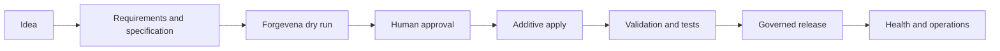
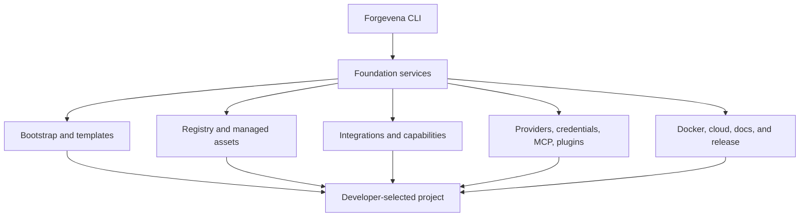
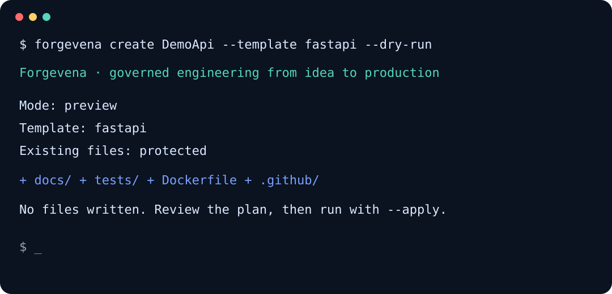

<div align="center">


# Forgevena

**Governed engineering from idea to production.**

[](https://github.com/rohitkumarnaidu/Forgevena/actions/workflows/ci.yml)
[](https://rohitkumarnaidu.github.io/Forgevena/)
[](https://github.com/rohitkumarnaidu/Forgevena/security)
[](https://github.com/rohitkumarnaidu/Forgevena/releases)
[](https://www.npmjs.com/package/forgevena)
[](https://www.npmjs.com/package/forgevena)
[](LICENSE)
[](package.json)
[](.github/workflows/ci.yml)
[](https://github.com/rohitkumarnaidu/Forgevena/stargazers)
[](https://github.com/rohitkumarnaidu/Forgevena/forks)
[](https://github.com/rohitkumarnaidu/Forgevena/issues)
[](https://github.com/rohitkumarnaidu/Forgevena/pulls)

Enterprise project bootstrap, governed AI providers, MCP and plugin controls, secure local state, cloud preparation, validation, upgrades, diagnostics, and automated release engineering through one safety-first CLI.

[Documentation](https://rohitkumarnaidu.github.io/Forgevena/) · [Quick Start](#quick-start) · [Architecture](#architecture) · [Security](SECURITY.md) · [Contributing](CONTRIBUTING.md)

</div>

## Why Forgevena?

Modern engineering teams repeatedly solve the same setup, governance, integration, and release problems. Forgevena turns those practices into an additive and auditable developer platform without replacing application code or silently transmitting project data.

## Features

- **Enterprise bootstrap:** React, Next.js, FastAPI, Express, Python, Flutter, AI agent, RAG, full-stack AI, microservices, library, CLI, blank, and enterprise templates.
- **Existing-project safety:** preview-first initialization that skips every existing file and protects application directories.
- **Governed integrations:** OpenSpec, SkillOpt, gstack, design.md, claude-mem, GitNexus, Understand Anything, MCP servers, and declarative plugins.
- **Provider controls:** OpenAI, Anthropic/Claude, Gemini, OpenRouter, and Ollama use the preview `ProviderAdapter v1` contract with secret-reference-only configuration, explicit transmission consent, compatibility evidence, ordered streaming, and bounded resilience. Codex, Cursor, and Windsurf remain compatibility-only agent hosts.
- **Cloud preparation:** Render, Railway, Vercel, AWS, Azure, and Google Cloud preflight plans, validation, dry runs, health checks, and rollback guidance.
- **Release engineering:** signed-tag automation for changelog notes, GitHub Releases, npm, GitHub Packages, GHCR, Docker Hub, checksums, SBOMs, provenance, and package-manager bundles.
- **Certified reliability:** checksummed state, transaction recovery, encrypted vault migration, 32-writer concurrency, 1,000 corruption cases, mutation testing, and enforced performance budgets.
- **Cross-platform:** Windows 11, WSL2/Linux, and macOS on x64 and arm64 through npm with Node.js 20.19 or newer; standalone `v1.3.0` executables target x64.

## Quick Start

```bash
npm install --global forgevena@1.3.0
forgevena doctor
forgevena create DemoApi --template fastapi --dry-run --verbose
forgevena create DemoApi --template fastapi --apply
cd DemoApi
forgevena validate
```

Release downloads include smoke-tested Windows, Linux, and macOS x64 executables, checksums, SBOMs, provenance, verification evidence, and package-manager bundles on the [GitHub Releases page](https://github.com/rohitkumarnaidu/Forgevena/releases/latest). Verify native files against `RELEASE_SHA256SUMS`; npm users can verify the stable version with `npm view forgevena version`.

## Install from Homebrew

The maintained [Forgevena Homebrew tap](https://github.com/rohitkumarnaidu/homebrew-forgevena) installs the verified native executable on Linux and Intel macOS:

```bash
brew install rohitkumarnaidu/forgevena/forgevena
forgevena version
forgevena doctor
```

The current tap supports x64 release assets. Use npm on arm64 until native arm64 assets are published. Winget `1.2.3` is published upstream; Chocolatey `1.2.3` has passed automated checks and remains in human moderation. See the [installation guide](docs/installation/index.md) for authoritative channel versions and status.

For an existing repository, always preview first:

```bash
cd ExistingProject
forgevena init --dry-run --verbose
forgevena init --apply
```

The legacy `ai-workspace` executable and `.ai-workspace/` state directory remain supported throughout the 1.x release line. See the [migration guide](docs/migration/FORGEVENA_1_1.md).

## Safety Model

- Project changes preview by default; local writes require `--apply`.
- Existing files, manifests, and application directories are never overwritten.
- External commands require an impact plan and explicit approval.
- Tracked provider configuration stores environment-variable references, never secret values.
- Prompts, responses, credentials, authorization headers, and MCP payloads are redacted from logs.
- MCP servers and plugins remain disabled until explicitly trusted and activated.
- Rollback removes only unchanged files recorded as managed assets.

## CLI Examples

```bash
forgevena templates
forgevena integrations
forgevena providers init openai --apply
forgevena credentials configure openai --apply
forgevena providers verify openai
forgevena mcp list
forgevena plugins list
forgevena cloud render generate --dry-run
forgevena docker validate
forgevena status
```

## Enterprise Workflow



## Architecture



The architecture is intentionally modular and frozen for the 1.x line. New core abstractions require demonstrated need and an approved ADR. Read the [architecture guide](docs/architecture/overview.md) and [ADR index](docs/ADR_INDEX.md).

## Documentation and Examples

- [Installation](docs/installation/index.md)
- [CLI reference](docs/cli/reference.md)
- [Bootstrap guide](docs/bootstrap/guide.md)
- [Provider configuration](docs/providers/reference.md)
- [Integrations](docs/integrations/reference.md)
- [Security guide](docs/security/guide.md)
- [Examples catalog](docs/examples/production-catalog.md)
- [Operations and runbooks](docs/operations/runbooks.md)
- [Release guide](docs/release/index.md)

## Built with Codex and GPT-5.6

Forgevena was developed through an AI-assisted engineering workflow using Codex and GPT-5.6 for architecture planning, implementation, testing, documentation, CI/CD repair, security review, and release engineering. Changes were reviewed and validated with automated tests and GitHub Actions before release.

## Project Preview



The repository includes placeholders for future verified screenshots and terminal demonstrations. Published media must redact credentials, personal paths, project data, and provider responses.

## Roadmap

The stable platform prioritizes compatibility, validation, security hardening, account-backed integration verification, and community-requested improvements. See [ROADMAP.md](ROADMAP.md).

## Community

- Read [CONTRIBUTING.md](CONTRIBUTING.md) before proposing changes.
- Use [GitHub Discussions](https://github.com/rohitkumarnaidu/Forgevena/discussions) for design questions and ideas.
- Use [GitHub Issues](https://github.com/rohitkumarnaidu/Forgevena/issues) for reproducible defects and accepted feature requests.
- Follow [CODE_OF_CONDUCT.md](CODE_OF_CONDUCT.md) in every project space.

## Security and Support

Do not report vulnerabilities publicly. Follow [SECURITY.md](SECURITY.md) and use GitHub private vulnerability reporting when available. General support channels and response expectations are documented in [SUPPORT.md](SUPPORT.md).

## Contributing

Focused contributions are welcome. Every change must preserve additive safety, consent gates, secret isolation, backward compatibility, tests, and documentation. See [CONTRIBUTING.md](CONTRIBUTING.md) and [GOVERNANCE.md](GOVERNANCE.md).

## License

Forgevena is available under the [MIT License](LICENSE). Third-party notices are documented in [THIRD_PARTY_LICENSES.md](THIRD_PARTY_LICENSES.md) and [NOTICE](NOTICE).
