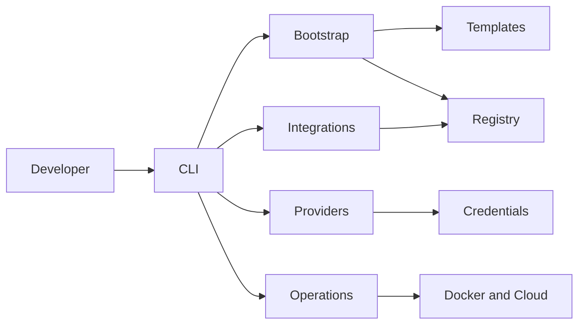

# Forgevena

**Governed engineering from idea to production.**

Forgevena is a safety-first developer platform for creating enterprise project baselines, adding governed AI tooling, configuring providers, managing declarative MCP/plugins, and preparing container and cloud deployments.

## Features

- Preview-first, additive project creation and initialization.
- Fourteen stack-aware templates with tests, CI, security, and container assets.
- Registry-backed modules, integrations, providers, operations, and managed rollback.
- OpenAI, Claude, Gemini, OpenRouter, Ollama, Codex, Cursor, and Windsurf profiles.
- OpenSpec, SkillOpt, gstack, design.md, Astryx, claude-mem, GitNexus, and Understand Anything integrations.
- Credential isolation, policy limits, redacted logs, governed MCP/plugins, and loopback dashboard.
- Docker and declarative cloud preparation across major platforms.

## Architecture



## Installation and quick start

```powershell
npm install --global forgevena@1.2.1
forgevena doctor
forgevena create Demo --template fastapi --dry-run --verbose
forgevena create Demo --template fastapi --apply
cd Demo
forgevena validate
```

The stable package is published on npm. Verified archives, checksums, SBOMs, provenance, and package-manager bundles are available from the [latest GitHub Release](https://github.com/rohitkumarnaidu/Forgevena/releases/latest). Supported platforms are Windows, Linux/WSL, and macOS on x64 and arm64 with Node.js 20.19+.

## CLI examples

```powershell
forgevena init --dry-run --verbose
forgevena integrations install openspec
forgevena credentials configure openai --apply
forgevena providers verify openai
forgevena plugins list
forgevena mcp list
forgevena docker validate
forgevena cloud render generate --dry-run
```

## Product views

The authenticated loopback dashboard presents ecosystem health, provider and credential status, integration state, MCP/plugins, and cloud readiness. Terminal examples and runnable workflows are available in [Examples](examples/index.md); no fabricated screenshots are included.

## Repository structure

| Path | Purpose |
|---|---|
| `bin/` | Executable CLI entry point |
| `src/` | Platform domains and adapters |
| `templates/` | Workspace template assets |
| `test/` | Automated test suite |
| `docs/` | Versioned documentation and audit evidence |
| `examples/` | Provider and plugin examples |
| `scripts/` | Installation, packaging, benchmark, and verification |

## Learn and contribute

- [Documentation portal](index.md)
- [Getting started](getting-started/index.md)
- [Architecture](architecture/overview.md)
- [CLI reference](cli/reference.md)
- [Roadmap](roadmap/index.md)
- [Contributor guide](contributor/index.md)
- [Support](../SUPPORT.md)

The project is licensed under the [MIT License](../LICENSE). Security reports follow the private process in [Security Response](SECURITY_RESPONSE.md).
