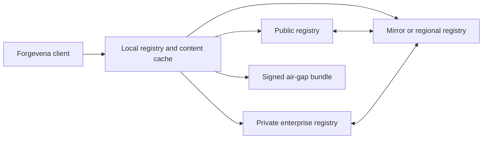

# ForgeRegistry Protocol and Architecture

> **Status:** Strategic architecture target. Contract details require approved ADRs before implementation.

## Responsibility

ForgeRegistry is the package protocol and registry foundation beneath ForgeHub. It defines immutable package identity, manifests, namespaces, dependency resolution, lockfiles, compatibility, signatures, provenance, caching, mirroring, federation, and offline exchange.

ForgeRegistry is not a marketplace UI, recommendation engine, billing service, or mandatory hosted registry.

## Topology

Every source has an explicit trust policy. Offline and local-only operation remains complete.

## Core Contracts

- Namespaced package identity and immutable semantic versions.
- Canonical manifest serialization and content-addressed blobs.
- Deterministic dependency resolution with source-aware lockfiles.
- Capability type, platform, host, policy, and version compatibility.
- Publisher, signature, provenance, SBOM, license, support, and lifecycle metadata.
- Revocation, vulnerability, deprecation, withdrawal, and last-known-good records.
- Registry capabilities, protocol negotiation, pagination, conditional requests, and bounded errors.

## Resolver Rules

Resolution is deterministic for the same lockfile, policy, registry snapshots, and platform facts. It must prevent cross-registry substitution, namespace shadowing, dependency confusion, downgrade attacks, revoked artifacts, and incompatible capability composition. Network discovery cannot silently change a locked result.

## Storage and Caching

Artifacts are addressed by cryptographic digest. Metadata and blobs are independently verifiable. Cache corruption fails visibly; repair never substitutes unverified content. Garbage collection preserves active locks, rollback targets, quarantine evidence, and retention policy.

## Federation and Mirroring

Federation is policy-directed, not ambient. Registries declare authorities, namespaces, trust roots, replication state, conflict rules, and data residency. Mirrors preserve origin identity and signed metadata. Conflicts fail closed and produce repair guidance.

## Air-Gapped Operation

Export bundles include packages, metadata, dependency closure, lockfiles, signatures, trust roots, revocations, SBOMs, licenses, and verification reports. Promotion across development, staging, and production zones is explicit, signed, and auditable.

## API Direction

The protocol will define versioned read, publish, withdraw, advisory, revocation, transparency, namespace, and health operations. OCI may transport blobs, but OCI is not the semantic package contract. Clients negotiate supported contract versions and reject incompatible responses.

## Migration and Rollback

Existing provider, plugin, MCP, template, skill, and workflow formats enter through adapters. Migration produces a preview, compatibility report, lockfile, and rollback snapshot. Failed registry changes retain the previous source configuration and last-known-good packages.

## Acceptance Evidence

- Deterministic resolution and reproducible lockfiles across supported operating systems.
- Corruption, interruption, conflict, downgrade, and dependency-confusion tests.
- Signature, revocation, transparency, mirror, and offline verification.
- Recovery from registry outage without losing local operation.
- Protocol conformance fixtures and interoperability with an independent implementation.

## Capability-Aware Resolution

ForgeRegistry stores and resolves the canonical packages defined by the [Enterprise Capability System](ENTERPRISE_CAPABILITY_SYSTEM.md). Resolution operates at both package and capability levels. It verifies package integrity while preserving independent capability identities, permissions, peer dependencies, conflicts, maturity, and host requirements.

A package lock records selected releases, capability exports, adapter versions, translation outcomes, policy decisions, and evidence references. Namespaced types such as `community.robotics/simulator` extend the ecosystem without adding a new resolver enum.

Registry policy cannot activate a capability. It may verify, resolve, cache, quarantine, revoke, or distribute packages; activation remains a governed Forgevena Core operation.
