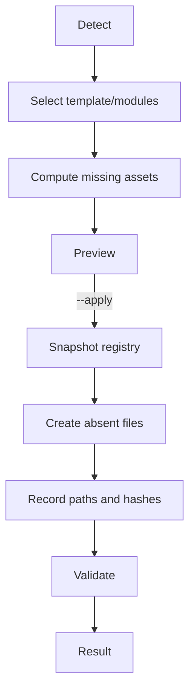
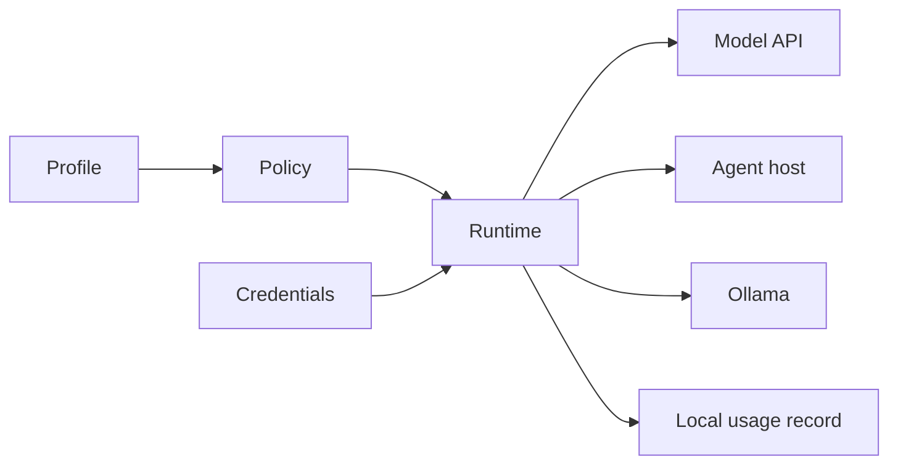
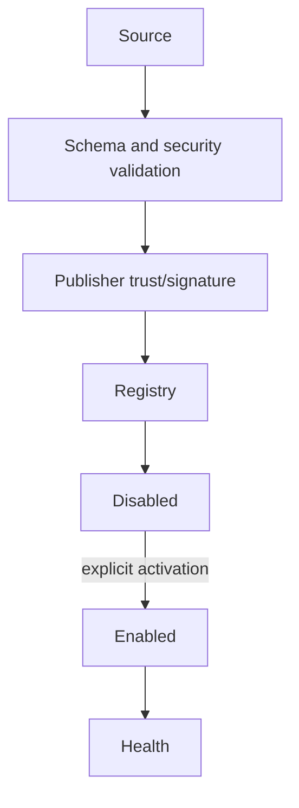
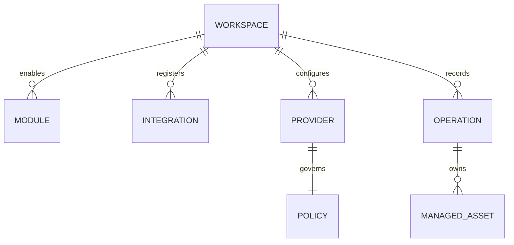

# Architecture Diagrams

## Bootstrap flow

```mermaid
flowchart TD
  Detect --> Select[Select template/modules]
  Select --> Plan[Compute missing assets]
  Plan --> Preview
  Preview -->|--apply| Backup[Snapshot registry]
  Backup --> Write[Create absent files]
  Write --> Manifest[Record paths and hashes]
  Manifest --> Validate
  Validate --> Result
```

## Provider flow

```mermaid
flowchart LR
  Profile --> Policy
  Policy --> Runtime
  Credentials --> Runtime
  Runtime --> API[Model API]
  Runtime --> Host[Agent host]
  Runtime --> Local[Ollama]
  Runtime --> Usage[Local usage record]
```

## Plugin and MCP flow

```mermaid
flowchart TD
  Source --> Validate[Schema and security validation]
  Validate --> Trust[Publisher trust/signature]
  Trust --> Registry
  Registry --> Disabled
  Disabled -->|explicit activation| Enabled
  Enabled --> Health
```

## Registry relationships

```mermaid
erDiagram
  WORKSPACE ||--o{ MODULE : enables
  WORKSPACE ||--o{ INTEGRATION : registers
  WORKSPACE ||--o{ PROVIDER : configures
  WORKSPACE ||--o{ OPERATION : records
  OPERATION ||--o{ MANAGED_ASSET : owns
  PROVIDER ||--|| POLICY : governs
```
