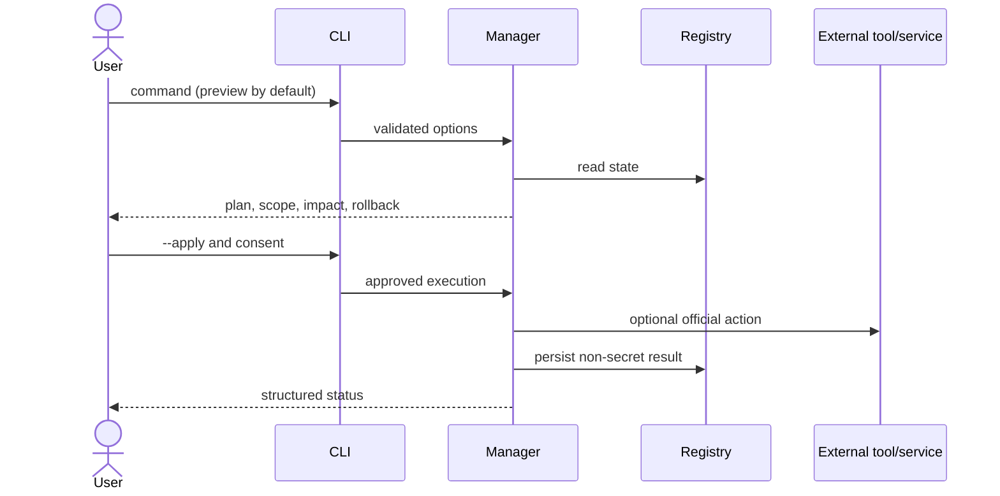

# Architecture Overview

AI Engineering Workspace is a local-first Node.js CLI with additive project generation, registry-backed lifecycle state, consent-gated external actions, and pluggable provider, MCP, plugin, and cloud adapters.

## Components

| Component | Responsibility | State |
|---|---|---|
| CLI router | Parse commands, flags, safety policy, and output | Process only |
| Project/bootstrap | Detect stacks, plan assets, apply missing files, validate, roll back owned files | Managed-assets manifest |
| Module manager | Expose consistent module lifecycle contracts | Workspace registry |
| Integration manager | Plan official workflows and project artifacts | Integration registry entries |
| Provider runtime | Profiles, policies, invocation, retries, usage, health | Provider profiles and policy |
| Credential manager | Masked input, environment lookup, local/encrypted storage | Ignored secret files |
| MCP/plugin managers | Validate, trust, activate, health-check, and remove registry state | Dedicated registries |
| Cloud/Docker adapters | Prepare and validate declarative deployment assets | Project assets and registry |
| Logging/dashboard | Redacted operational events and loopback status UI | Local logs |

## Request flow

## Design decisions and trade-offs

- **Additive-only assets:** prevents source loss; format-aware merging is intentionally excluded.
- **Preview-first execution:** adds one step but makes effects reviewable.
- **Registry-only removal for external integrations:** avoids deleting unmanaged upstream state.
- **Local secret references:** reduces leakage; enterprise secret-manager synchronization remains operator-owned.
- **Declarative plugins and MCP:** favors governance and validation over arbitrary in-process code.
- **Frozen core architecture:** new core abstractions require an approved ADR.

Read [ADR index](../adrs/index.md), [registry](../registry/reference.md), and [security](../security/guide.md).
