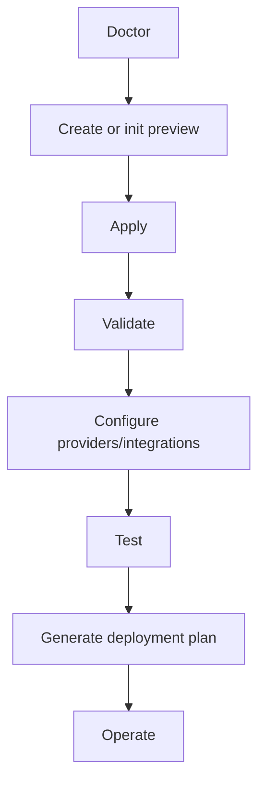

# Getting Started

## Requirements

- Windows 11, WSL2/Linux, or macOS on x64 or arm64.
- Node.js 20.19 or newer.
- Git for project initialization and Git-backed deployment workflows.
- Optional: Docker Desktop/Engine, provider CLIs, and provider credentials.

## Install

```powershell
npm install --global forgevena@1.3.0
forgevena version
forgevena doctor
```

For offline installation, download the verified archive and `RELEASE_SHA256SUMS` from the [latest release](https://github.com/rohitkumarnaidu/Forgevena/releases/latest), verify the checksum, then run `npm install --global ./forgevena-1.3.0.tgz`.

On Linux or Intel macOS, you can instead use the maintained Homebrew tap:

```bash
brew install rohitkumarnaidu/forgevena/forgevena
forgevena version
forgevena doctor
```

The current native release assets are x64-only; use npm on arm64.

## Create a first project

Preview, inspect, then apply:

```powershell
forgevena create DemoApi --template fastapi --dry-run --verbose
forgevena create DemoApi --template fastapi --apply
cd DemoApi
forgevena validate
```

## Initialize an existing project

```powershell
cd ExistingProject
forgevena init --dry-run --verbose
forgevena init --apply
```

Initialization is additive. Existing source, manifests, configuration, and documentation are reported as skipped.

## First integration and provider

```powershell
ai-workspace integrations install openspec
ai-workspace integrations init openspec --apply
ai-workspace providers init openai --apply
ai-workspace credentials configure openai --apply
ai-workspace providers verify openai
```

The credential command prompts locally with masked input; no secret is accepted as a command argument.

## First deployment plan

```powershell
ai-workspace cloud render generate --dry-run
ai-workspace cloud render generate --apply
ai-workspace cloud render validate
ai-workspace cloud render plan
```

Deployment never runs automatically. Review [Deployment](../deployment/guide.md) before applying any remote action.

## Common workflow



If a command fails, use `--verbose`, then consult [Troubleshooting](../troubleshooting/index.md).
