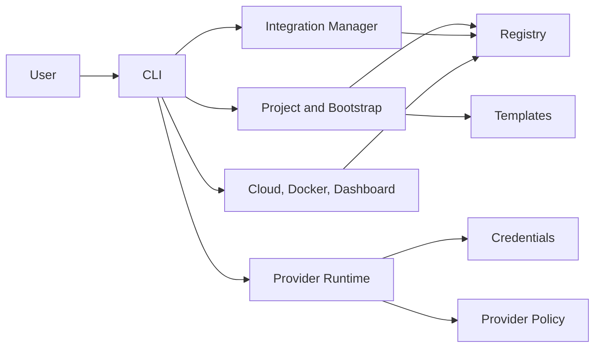

# Forgevena Documentation

Current stable version: **1.2.3**

**Governed engineering from idea to production.**

This portal is the canonical entry point for installing, operating, extending, and maintaining Forgevena. Existing historical, phase, release, and audit records remain available at the root of `docs/`.

```powershell
npm install --global forgevena@1.2.3
forgevena version
forgevena doctor
```

Use the [latest GitHub Release](https://github.com/rohitkumarnaidu/Forgevena/releases/latest) for verified archives, checksums, SBOMs, provenance, and Homebrew, Winget, or Chocolatey submission bundles.

## Start here

- [Getting started](getting-started/index.md)
- [Architecture](architecture/overview.md)
- [CLI reference](cli/reference.md)
- [Configuration reference](configuration/reference.md)
- [Security guide](security/guide.md)
- [Troubleshooting](troubleshooting/index.md)
- [Documentation website](website/OPERATIONS.md)
- [Public brand discovery](branding/BRAND_DISCOVERY.md)

## Platform domains

| Domain | Documentation |
|---|---|
| Modules and capabilities | [Modules](modules/reference.md), [capabilities](capabilities/reference.md) |
| Project generation | [Templates](templates/reference.md), [bootstrap](bootstrap/guide.md) |
| AI services | [Providers](providers/reference.md), [credentials](security/guide.md#credentials) |
| External tools | [Integrations](integrations/reference.md), [MCP and plugins](plugins/guide.md) |
| State | [Registry and managed assets](registry/reference.md), [configuration](configuration/reference.md) |
| Delivery | [Deployment](deployment/guide.md), [operations](operations/runbooks.md) |
| Engineering | [Developer guide](developer/index.md), [testing](testing/guide.md), [maintainers](maintainer/index.md) |
| Releases | [Release engineering](release/index.md), [package publishing](release/PACKAGE_PUBLISHING.md) |

## Architecture map



## Documentation conventions

Commands use `forgevena`; the legacy `ai-workspace` alias remains supported throughout 1.x. When running from source, substitute `node ./bin/forgevena.js`. Modifying commands preview by default. `--apply` enables local writes, and external actions additionally require `--yes` or interactive approval. Existing files are skipped.

See [Documentation coverage](DOCUMENTATION_COVERAGE.md) for the audited source-to-document matrix.
