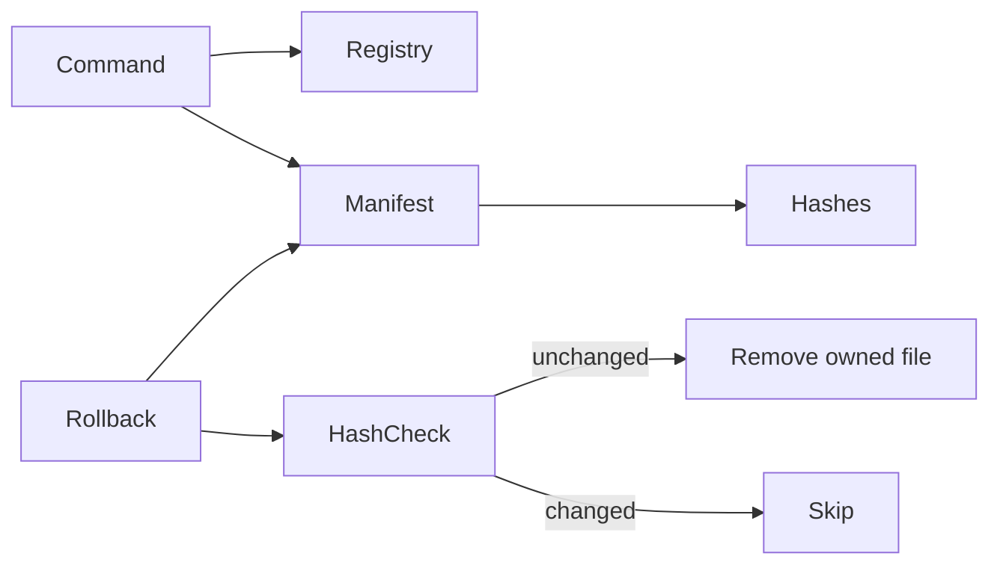

# Registry and Managed Assets

The workspace registry is `.ai-workspace/workspace.json` (schema version 2). It records identity, platform version, template, modules, integrations, providers, and lifecycle timestamps. It must never contain secret values.

`.ai-workspace/managed-assets.json` records additive operations:

- operation identifier and timestamp;
- command/template/module metadata;
- registry snapshot;
- each created path and SHA-256 content hash.

Registry migration is owned by the upgrade command. Back up before upgrades and do not hand-edit schema versions. Validate with `ai-workspace status` and `ai-workspace validate`.

`forgevena state validate` also reports transaction-journal health. A malformed journal, an unexpected backup path, or a missing required recovery backup leaves the workspace unhealthy and blocks recovery rather than guessing or deleting state. Inspect the error, restore from a verified snapshot when necessary, and rerun validation before applying `forgevena state repair --apply`.
