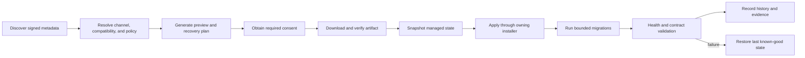

# Enterprise Update Management Strategy

> **Status:** Product strategy and architecture requirements
>
> **Scope:** Forgevena core, CLI, dashboard, providers, plugins, MCP servers, templates, catalogs, documentation, and approved ecosystem components
>
> **Companion documents:** [Platform blueprint](FORGEVENA_PLATFORM_BLUEPRINT.md) and [versioned product roadmap](FORGEVENA_VERSIONED_PRODUCT_ROADMAP.md)

## 1. Purpose

Forgevena needs an update experience comparable to mature developer platforms without weakening its local-first, preview-first, and consent-gated safety model. Updates are not a single installer action. They are a governed lifecycle covering discovery, compatibility, policy, verification, installation, migration, health validation, history, and rollback.

The Update Management System must answer five questions before any change:

1. What is installed, and who owns it?
2. What trusted update is available?
3. Is the update compatible and permitted?
4. What will change, and how can it be recovered?
5. Did the update produce a healthy, verifiable result?

## 2. Product Outcomes

- Notify users about relevant updates without forcing installation.
- Manage Forgevena and its governed ecosystem through one consistent lifecycle.
- Respect the original installation channel instead of bypassing package managers.
- Verify signatures, checksums, provenance, compatibility, and policy before mutation.
- Support stable, security-only, prerelease, and organization-approved channels.
- Preserve offline and air-gapped operation through signed update bundles.
- Record update history without collecting prompts, responses, credentials, or source content.
- Recover safely from interrupted or unhealthy updates.
- Give organizations controlled rollout, maintenance-window, and approval policies.

## 3. Non-Negotiable Safety Contract

- Update checks are read-only and independently configurable.
- Automatic network checks are opt-in where policy or installation context requires them.
- Downloads and installations are separate consent boundaries.
- Mutating actions preview first and require `--apply`; external effects also require explicit consent.
- Existing project files are never overwritten by platform updates.
- Project migrations operate only on schema-owned or manifest-owned state.
- Raw credentials are never given to update packages, plugins, or catalog metadata.
- Untrusted, unsigned, revoked, expired, incompatible, or downgraded artifacts fail closed.
- A failed update restores the last known-good managed state where technically possible.
- External package-manager rollback limitations are disclosed before installation.
- No update may silently enable telemetry, a provider, a plugin, an MCP server, or data egress.

## 4. Managed Update Domains

| Domain | Examples | Ownership and update rule |
| --- | --- | --- |
| Core platform | CLI, state schemas, dashboard, documentation assets | Use the detected installation channel and signed release metadata. |
| Providers | Adapter definitions, compatibility manifests, model metadata | Update independently only after contract and privacy-policy validation. |
| Plugins | Runtime package, manifest, SDK dependency | Require trusted publisher, declared permissions, integrity, and rollback evidence. |
| MCP | Server definition, transport profile, authentication reference | Never activate automatically; revalidate trust and capabilities after update. |
| Templates | Template packages, lockfiles, catalogs | Update catalogs separately from project files; project remediation remains preview-only. |
| Skills and workflows | Signed engineering assets and catalogs | Require provenance, compatibility, licensing, and policy approval. |
| Documentation | Product docs, generated references, examples | Version with the owning component and validate links and schema compatibility. |
| External integrations | OpenSpec, SkillOpt, GitNexus, agent-host integrations | Use official upstream mechanisms or produce manual guidance; never invent an installer. |

## 5. User Experience Surfaces

### 5.1 Startup Notification

The CLI and dashboard may perform a throttled, read-only check according to user policy. When an update exists, the notification shows:

- Installed and available versions.
- Release channel and publication date.
- Security severity and support status.
- Feature, fix, migration, and breaking-change summaries.
- Download size and installation source.
- Commands to inspect, defer, or apply the update.

The notification must be concise, dismissible, and suppressible per version. It must not delay normal CLI startup when the network is unavailable.

### 5.2 CLI

Planned command family:

```text
forgevena updates check
forgevena updates status
forgevena updates plan [component]
forgevena updates download [component] --apply
forgevena updates apply [component] --apply --yes
forgevena updates verify [operation]
forgevena updates history
forgevena updates rollback [operation] --apply --yes
forgevena updates dismiss <version>
forgevena updates channel <stable|security|next|rc> --apply
forgevena updates policy
```

Compatibility aliases such as `forgevena update` may route to `updates plan core`. Existing workspace-update commands keep their current meaning until a deprecation and migration plan is approved.

### 5.3 Dashboard Update Center

The dashboard should provide:

- Current platform and ecosystem inventory.
- Available, downloaded, blocked, deferred, failed, and installed updates.
- Release notes, migration guidance, compatibility analysis, and security advisories.
- Per-component update controls and a reviewed batch plan.
- Update history, verification evidence, logs, and rollback options.
- Maintenance-window, channel, proxy, bandwidth, and notification settings.
- Health status: latest, update recommended, security update required, or unsupported.

The dashboard remains loopback-only, authenticated, and subject to the same consent and policy engine as the CLI.

### 5.4 Notification Center

Notifications may include core releases, security advisories, ecosystem updates, compatibility blocks, deprecation deadlines, completed downloads, successful updates, failed updates, and required operator actions.

Notifications require deduplication, severity, timestamps, read/dismiss state, expiry, and links to evidence. Notification content must not include secrets or project content.

## 6. Update Lifecycle



Every lifecycle operation receives a stable operation ID and records metadata-only evidence.

## 7. Installation-Channel Awareness

Forgevena must detect and retain its installation source: npm, Homebrew, Winget, Chocolatey, GitHub native executable, container registry, source checkout, or organization-managed offline bundle.

The updater must not silently replace a package-manager installation with another mechanism:

- npm installations receive an `npm install --global forgevena@<version>` plan.
- Homebrew installations receive a tap update and `brew upgrade forgevena` plan.
- Winget and Chocolatey installations use their native upgrade commands.
- Native executables use verified replacement with a platform-safe handoff helper.
- Containers pull immutable digests and preserve the prior digest for rollback.

When self-replacement is unsafe or requires elevation, Forgevena prepares and validates the exact command but stops for user approval.

## 8. Trust and Supply-Chain Requirements

Update metadata and artifacts must support:

- Immutable semantic versions and release channels.
- SHA-256 or stronger content hashes.
- Signed metadata and artifact identity.
- Provenance and SBOM references.
- Publisher and signing-key rotation.
- Expiry, revocation, and compromised-release handling.
- Anti-rollback protection with explicit emergency override policy.
- Threshold signing for organization or high-risk catalogs where required.
- Cached metadata that can be verified offline.
- Transparency-log integration where available.

A TUF-inspired metadata model should be evaluated before remote catalogs become a production trust root. The design must separate root trust, targets, snapshots, timestamps, and delegated component catalogs.

## 9. Compatibility Resolution

Before download or installation, the resolver evaluates operating system, architecture, runtime requirements, state schemas, component contracts, dependencies, capabilities, policy, publisher approval, release channel, known conflicts, migrations, and rollback limitations.

The result is one of: compatible, compatible with migration, blocked by policy, blocked by dependency, unsupported host, or manual review required.

## 10. Download and Installation Policy

Users and organizations can configure:

- Check frequency: startup, daily, weekly, monthly, or manual.
- Download behavior: manual, automatic on unmetered networks, or maintenance window.
- Installation behavior: manual, security-only auto-apply, staged approval, or prohibited.
- Channels: stable, security-only, next, release candidate, or pinned version.
- Components: core, providers, plugins, templates, skills, docs, or selected catalogs.
- Network: proxy, certificate authority, bandwidth cap, retry policy, and mirror.
- Retention: downloaded artifacts, prior versions, logs, evidence, and snapshots.

Automatic installation is disabled by default. Security-only automation requires an explicit policy, verified recovery path, and successful preflight.

## 11. Enterprise Rollout Controls

Local policy bundles and a future optional control plane may define approved versions and publishers, canary and production rings, percentage rollout, maintenance windows, blackout periods, approvals, mandatory security deadlines, deferral limits, health thresholds, offline mirrors, and compliance evidence.

Fleet coordination belongs to the optional v2 control plane. The local client must still enforce imported signed policies without a server.

## 12. Recovery and Rollback

Before mutation, Forgevena records installed and target versions, installation source, verified artifact identity, managed snapshot, migration plan, owned scope, health checks, rollback command, and known limitations.

Rollback is domain-specific:

- Core state restores only verified managed snapshots.
- Native binaries retain a bounded last known-good executable.
- Package-manager installations use supported pin or downgrade workflows.
- Plugins and templates preserve immutable previous versions and registry pointers.
- Provider metadata and catalogs restore prior signed snapshots.
- Project files are never reverted by ecosystem updates.
- Cloud resources are never deleted automatically.

If rollback is impossible, the plan states that before approval.

## 13. Failure Handling

Failures report a stable error code, operation ID, failed stage, human-readable cause, mutation status, recovery status, manual actions, and redacted verification logs.

Interrupted downloads resume only after partial-content verification. Interrupted installations recover through transaction journals or package-manager state. Concurrent updates are serialized. Disk-full, permission, proxy, signature, compatibility, health, and migration failures receive dedicated tests.

## 14. Offline and Air-Gapped Updates

Signed update bundles contain the trusted metadata chain, selected artifacts and hashes, SBOM and provenance references, compatibility and migration manifests, release notes, known limitations, and expected verification results.

Bundle import verifies trust and compatibility without the internet. Export never includes credentials, source code, prompts, responses, or local policy secrets.

## 15. Data Model

Versioned state separates update settings, installed inventory, trusted roots, catalog snapshots, available-update cache, downloads, operations, snapshots, rollback references, notifications, and health evidence.

State must use the existing StateEngine, checksums, journals, migrations, and repair contracts. A new persistence layer is not permitted.

## 16. Privacy and Observability

Permitted update telemetry is local by default and limited to operational metadata such as duration, bytes, stage, result, and error class. Credentials, authorization headers, prompts, responses, source content, encrypted credential metadata, and private identifiers are excluded unless a specific field is explicitly approved.

Remote analytics remain opt-in. Diagnostic bundles disclose every included field before export.

## 17. Release Notes Contract

Every update exposes structured release notes with version, channel, date, support status, publisher, features, fixes, performance, advisories, breaking changes, deprecations, migrations, compatibility, artifact identity, known limitations, rollback restrictions, and verification evidence.

Machine-readable release notes enable dashboard rendering and policy evaluation without scraping Markdown.

## 18. Version Delivery Plan

| Version | Update-management milestone |
| --- | --- |
| `v1.3` | Trusted core metadata, install-source inventory, history, state snapshots, failure recovery, and CLI contract foundations. |
| `v1.4` | Provider compatibility updates, model deprecation alerts, and privacy-aware resolver inputs. |
| `v1.5` | Signed plugin and MCP updates, permission diffs, and last known-good runtime rollback. |
| `v1.6` | Signed template catalogs, package-manager-aware native updates, and immutable artifact verification. |
| `v1.7` | Organization update policy, channels, deferrals, maintenance windows, deadlines, and offline policy import. |
| `v1.8` | Dashboard Update Center, notifications, scheduled checks, diagnostics, release notes, and supply-chain evidence. |
| `v1.9` | Signed skill and workflow catalog updates with policy and compatibility resolution. |
| `v1.10` | Local enterprise certification, air-gapped bundles, update rehearsals, and health scoring. |
| `v2.0` | Optional fleet inventory, rollout rings, cohort deployment, remote policy distribution, and organization dashboards. |

## 19. Acceptance Criteria

- Check-only operations do not mutate managed state beyond an explicitly approved cache.
- Every artifact is verified before use and the owning installation channel is preserved.
- Compatibility and policy blocks occur before installation.
- All mutations have preview, consent, operation ID, history, and recovery evidence.
- Interrupted and concurrent operations cannot corrupt state.
- Failed health validation restores last known-good managed state where supported.
- Existing project files remain unchanged.
- Offline verification and signed-bundle import pass without network access.
- Notifications are deduplicated, dismissible, severity-aware, and privacy-safe.
- Windows, Ubuntu, and macOS update, rollback, and uninstall tests pass for supported channels.
- Revocation, key rotation, downgrade, disk-full, proxy, and permission failures are tested.
- Documentation, CLI help, dashboard, schemas, examples, and release evidence stay synchronized.

## 20. Additional Product Opportunities

- Compatibility graph explaining blocked updates.
- Update impact score based on migrations, permissions, dependencies, and rollback quality.
- Policy-safe batch planner that orders component updates by dependency.
- Canary health comparison before broad rollout.
- Verified delta downloads after reproducibility requirements are proven.
- Local mirror manager for teams and air-gapped environments.
- Security advisory inbox mapped to installed components.
- Support-lifecycle alerts for runtimes, models, and components.
- Reproducible update simulation against a managed snapshot.
- Exportable update attestation proving artifact, actor, policy, and result.

## 21. Explicit Non-Goals

- Forced updates without approved organization policy.
- Silent cross-channel replacement.
- Automatic project-code migration.
- Automatic cloud-resource deletion.
- Executing untrusted update scripts outside governed runtime boundaries.
- Claiming universal rollback when an upstream package manager does not support it.
- Requiring a hosted account for local updates.

## 22. Decision Summary

Forgevena should evolve from individual `update` commands into a governed ecosystem Update Center. The implementation must reuse StateEngine, consent, policy, registry, diagnostics, provider, plugin, template, and release contracts rather than create a parallel platform. The experience should feel simple while remaining explicit, verifiable, recoverable, and safe under enterprise operating constraints.
