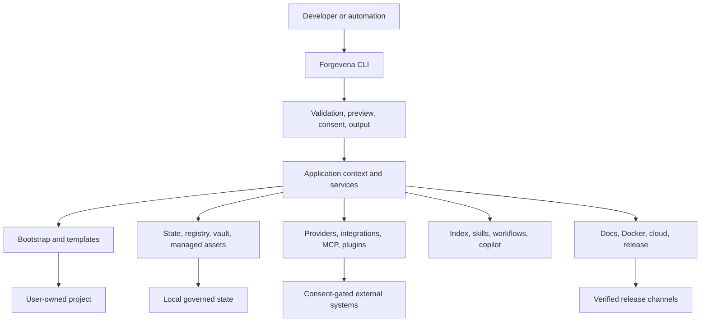

# Forgevena Platform Blueprint

> **Document purpose:** Define what Forgevena aims to become, how the product evolved, what `v1.2.3` implements today, where it is distributed, and which boundaries remain intentionally outside the current stable scope.
>
> **Evidence date:** 2026-07-20
> **Current stable release:** `v1.2.3`
> **Product caption:** Governed engineering from idea to production.
> **Status:** Public, local-first developer-platform foundation with production release channels and selected capabilities still progressing toward enterprise certification.

## 1. Executive Summary

Forgevena is a safety-first, local-first developer platform that turns repeatable engineering practices into governed workflows. It combines project bootstrap, lifecycle state, AI-provider controls, integrations, templates, release engineering, diagnostics, and engineering intelligence behind one cross-platform command-line interface.

The product is not intended to replace source code, IDEs, cloud platforms, package managers, AI providers, or human engineering judgment. It coordinates those systems through explicit plans, additive changes, policy boundaries, validation, and auditable local state.

The core product promise is:

> A developer can move from an idea or existing repository to a validated, documented, governed, and releasable project without surrendering ownership of source code, credentials, architecture, or deployment decisions.

## 2. Product Aim

### 2.1 Problem

Engineering teams repeatedly rebuild the same operational foundations:

- Repository structure, documentation, tests, CI, containers, and security policies.
- Safe onboarding of existing projects without destructive scaffolding.
- Provider credentials, model access, retries, health checks, and privacy controls.
- MCP server and plugin trust, permissions, lifecycle, and auditability.
- Release notes, packages, checksums, provenance, SBOMs, native assets, and distribution submissions.
- Architecture standards, project indexes, reusable engineering skills, and deterministic workflows.
- Local governance that still works when the network, provider, or future control plane is unavailable.

Point solutions solve parts of this problem but usually leave teams to integrate them manually. Forgevena aims to provide a coherent platform contract around the complete lifecycle.

### 2.2 Product Thesis

Forgevena is built on five beliefs:

1. **Safety is a product feature.** Preview, consent, ownership manifests, and rollback are part of the user experience.
2. **Local operation is the durable baseline.** Accounts and hosted services must be optional extensions, not prerequisites.
3. **AI requires governance, not just connectivity.** Credentials, data egress, provider compatibility, tools, and mutations need explicit controls.
4. **Release evidence matters as much as release automation.** Packages should be verifiable, reproducible, traceable, and installable.
5. **Enterprise maturity is earned through evidence.** A feature is not complete until behavior, tests, documentation, security impact, compatibility, and operations agree.

## 3. Evolution from the Original Idea

Forgevena began as an **AI Engineering Workspace** concept: install selected AI-development tools once and initialize safe project-specific assets. The scope matured through implementation evidence.

| Evolution stage | Initial question | Resulting product capability |
| --- | --- | --- |
| Tool installer | How can OpenSpec, SkillOpt, gstack, design systems, memory, and code-intelligence tools be installed consistently? | Official-method planning, prerequisite detection, manual-only guidance, and consent-gated integration life cycles. |
| Project bootstrap | How can new and existing repositories receive enterprise foundations safely? | `create`, `init`, templates, additive assets, validation, managed ownership, and rollback. |
| Integration platform | How can tools follow one lifecycle without inventing unsupported installers? | Metadata, detection, plan, configure, validate, health, status, update, remove, and rollback contracts. |
| Developer platform | How can bootstrap, AI, cloud, policy, documentation, and releases work coherently? | Shared state, credentials, providers, plugins, MCP, templates, diagnostics, release automation, and engineering capabilities. |
| Local enterprise platform | How can teams gain governance without mandatory SaaS? | Signed local policy, secret-reference-only configuration, offline operation, auditable actions, and a future optional control-plane boundary. |

This progression is intentional. Forgevena is no longer a collection of installers; it is an internal-developer-platform foundation with AI-aware governance.

## 4. Product Principles and Invariants

The following constraints define the 1.x product contract:

- Modifying commands preview by default.
- Local writes require `--apply`.
- Network calls, installations, deployments, and other external effects require explicit consent.
- Existing project files are skipped rather than overwritten.
- `--merge` and `--replace` remain compatibility flags with skip-only safety until a format-aware merge design is approved.
- Rollback removes only unchanged files recorded as Forgevena-managed assets.
- Unmanaged files and external resources are never deleted automatically.
- Tracked files store credential references, never raw API keys.
- Prompts, responses, tokens, authorization headers, and secret values are excluded from registries and redacted from logs.
- The `ai-workspace` executable and `.ai-workspace/` state path remain supported throughout 1.x.
- New core abstractions require a demonstrated need and an approved architecture decision record.

## 5. Intended Users

### 5.1 Primary Users

- Solo developers building long-lived products with AI-assisted engineering.
- Startup teams that need repeatable project and release standards without a platform team.
- Platform and DevOps engineers creating governed developer workflows.
- AI engineers who need provider, credential, MCP, plugin, and data-egress controls.
- Open-source maintainers who need cross-platform validation and multi-channel distribution.
- Enterprise teams evaluating a local-first foundation before adopting a remote control plane.

### 5.2 Representative Use Cases

- Create a new FastAPI, Next.js, RAG, agent, microservices, or enterprise project.
- Add documentation, tests, CI, Docker, monitoring, design guidance, and AI configuration to an existing repository without changing application code.
- Configure OpenAI, Anthropic, Gemini, OpenRouter, Ollama, or supported agent hosts through secret references.
- Register and validate MCP servers or signed plugins before activation.
- Prepare cloud deployment assets while stopping at credential, billing, and approval boundaries.
- Build a local project index, inspect relationships, and request read-only engineering recommendations.
- Produce signed release tags, native executables, package-manager bundles, checksums, an SBOM, provenance, and verification reports.

## 6. Current Platform Scope in `v1.2.3`

### 6.1 CLI and Compatibility Surface

The preferred executable is `forgevena`. The transitional `ai-workspace` alias remains supported.

Current command families include:

| Domain | Commands and responsibilities |
| --- | --- |
| Environment | `doctor`, `status`, `validate`, `version`, and structured health reporting. |
| State and vault | Validate, repair, snapshot, migrate, inspect history, initialize, rotate, recover, and audit. |
| Projects | `create`, `init`, `add`, `remove`, `update`, `upgrade`, `rollback`, and managed validation. |
| Tools and integrations | Install planning, references, capabilities, lifecycle status, health, and project initialization. |
| Credentials | Masked configuration, validation, rotation, encrypted backup, status, and safe removal. |
| Providers | Profiles, models, project routing, limits, health, invocation, verification, login plans, and MCP guidance. |
| MCP and plugins | Registration, validation, trust, activation, health, updates, permissions, and registry-safe removal. |
| Cloud and Docker | Preparation, validation, verification, deployment preflight, health, status, and rollback plans. |
| Templates and configuration | Built-in templates, package catalogs, configuration export/import, and generated assets. |
| Intelligence | Project index, semantic index, recommendations, and read-only copilot planning. |
| Operations | Loopback dashboard, diagnostics, ecosystem health, logs, and release/upgrade support. |

Machine-readable responses use an envelope containing `schemaVersion`, `operationId`, `status`, `warnings`, `changes`, and stable error information.

### 6.2 Project Bootstrap

Forgevena supports fourteen built-in templates:

1. React
2. Next.js
3. FastAPI
4. Express
5. Flutter
6. Python
7. AI Agent
8. RAG
9. Full Stack AI
10. Microservices
11. Library
12. CLI
13. Blank
14. Enterprise

Template-owned assets can include source baselines, tests, documentation, Git configuration, GitHub Actions, Docker assets, environment examples, security policy, monitoring guidance, prompts, and provider configuration. Generation remains additive and exclusive-create.

For existing repositories, `forgevena init --dry-run --verbose` detects frameworks and reports missing platform assets before any write. Protected application locations such as `src/`, `backend/`, `frontend/`, manifests, and existing documentation are preserved.

### 6.3 State, Registry, and Rollback

The local state system provides:

- Schema-aware state documents under `.ai-workspace/`.
- Atomic writes and checksums.
- Corruption detection that fails visibly instead of silently resetting state.
- Serialized concurrent updates.
- Multi-document transactions and rollback on failed transactions.
- Workspace-contained path enforcement.
- Snapshots and operation history.
- Managed-assets manifests recording ownership and content hashes.
- Rollback that skips modified or unmanaged files.

The current foundation is functional, while the `v1.3.0` program will raise concurrency, fuzzing, crash recovery, migration, and coverage evidence to enterprise acceptance thresholds.

### 6.4 Credential Vault and Secret Handling

Forgevena supports environment-based credentials and encrypted local credentials. The vault includes:

- AES-256-GCM authenticated encryption.
- Argon2id derivation with PBKDF2 fallback for supported migration paths.
- Initialize, configure, rotate, validate, audit, recover, back up, and remove operations.
- Tamper detection for ciphertext and metadata.
- Bounded recovery history.
- Explicit migration of legacy credential formats.
- Masked prompts; credential values are not accepted as normal command arguments.

Cloud accounts, operating-system credential stores, enterprise secret managers, and provider accounts remain operator-owned.

### 6.5 Provider Platform

Current provider and host profiles cover:

- OpenAI
- Anthropic/Claude
- Gemini
- OpenRouter
- Ollama
- Codex
- Cursor
- Windsurf

Implemented behavior includes capability declarations, credential references, health, model discovery where supported, normalized invocation, retries for retryable operations, `Retry-After` handling, idempotency awareness, budgets, rate limits, project routing, and redacted results.

Live compatibility depends on user-owned credentials, network access, provider terms, model availability, and data-use approval. `v1.4.0` will convert the current adapters into a formally certified provider platform with dated compatibility evidence.

### 6.6 MCP and Plugin Governance

Current capabilities include:

- MCP registration, validation, activation, deactivation, removal, and health checks.
- Rejection of inline credentials.
- Retry handling for transient remote MCP health failures.
- Signed declarative plugin manifests.
- Trusted-publisher registration and integrity checks.
- Plugin update history, dependencies, permissions, and health.
- Isolated JSON-RPC worker execution for supported runtime plugins.
- Start, invoke, reload, and stop lifecycle operations.
- Denial of undeclared capabilities and unsafe entry points.

Remote packages and broad ecosystem execution remain constrained until signing, transport, sandbox, and compatibility guarantees meet the `v1.5.0` acceptance gates.

### 6.7 Templates and Catalogs

Forgevena includes versioned template-package foundations:

- Template manifests and schema versioning.
- Asset hashes and path-escape protection.
- Inheritance with explicit replacement rules.
- Export of built-in templates to additive local packages.
- Signed local catalogs.
- Consent-gated HTTPS catalogs.
- Cached offline signature verification.

`v1.6.0` will move this from a bridge implementation to the primary independently managed template ecosystem.

### 6.8 Organization Policy

Signed local organization policies currently support:

- Principals and trusted signers.
- Deny-overrides evaluation.
- Approval requirements for engineering assets.
- Enforcement in selected provider and copilot paths.
- Metadata-only decisions and local operation.

The complete cross-platform policy boundary for every external effect is a `v1.7.0` objective.

### 6.9 Cloud and Container Preparation

Cloud adapters cover Render, Vercel, Railway, Fly.io, Azure, AWS, Google Cloud, and DigitalOcean foundations. Depending on the provider, Forgevena can generate or validate declarative assets, check credentials, prepare deployment plans, perform health checks, and describe rollback.

Important boundaries:

- A plan is not a production architecture.
- Account-specific IAM, networking, billing, compliance, regions, and data residency remain the operator's responsibility.
- External resources are never deleted automatically.
- Deployment requires explicit consent and user-owned credentials.

Docker capabilities include plan, validation, startup, and shutdown workflows for managed configurations.

### 6.10 Engineering Intelligence

Current local engineering capabilities include:

- Metadata-only project indexing for files, symbols, manifests, and relationships.
- Query and deterministic recommendation plans.
- Optional semantic indexes through configured embedding providers.
- Storage of embeddings and approved metadata rather than raw source content by default.
- Signed prompts and engineering assets with provenance.
- Deterministic, retryable, resumable workflow foundations.
- Read-only engineering copilot planning with policy checks.

These features are intentionally conservative. Mutations remain preview-first and require consent. `v1.9.0` and `v1.10.0` will provide the certification, catalogs, incremental indexing, explainable results, and enterprise evidence required for broader claims.

### 6.11 Documentation and Operations

The repository includes:

- Architecture, ADR, CLI, provider, integration, bootstrap, template, security, testing, deployment, operations, operational-guide, API, schema, and release documentation.
- Generated command and metadata references.
- Strict MkDocs publication to GitHub Pages.
- Link, Markdown, security, package, and documentation workflows.
- Structured local logs with recursive secret redaction.
- Local metrics, trace spans, health aggregation, and diagnostic bundles.
- A loopback-only, token-protected dashboard.

Documentation is published at <https://rohitkumarnaidu.github.io/Forgevena/>.

### 6.12 Release and Supply Chain

The release system supports:

- Signed immutable semantic-version tags.
- Pull-request and release verification on Windows, Ubuntu, and macOS with Node.js 20 and 22.
- Automated changelog and GitHub Release generation.
- npm Trusted Publishing through GitHub Actions OIDC.
- GitHub Packages and GHCR publication.
- Optional Docker Hub publication when credentials are configured.
- Standalone Windows, Linux, and macOS x64 executables.
- SHA-256 checksums, CycloneDX SBOM, provenance, distribution manifest, and verification reports.
- Homebrew, Winget, and Chocolatey bundle generation.
- Package smoke tests and immutable-version checks.

## 7. Current Distribution Status

The following snapshot was verified on 2026-07-20.

| Channel | Current status | Evidence or limitation |
| --- | --- | --- |
| npm | Published and stable | `forgevena@1.2.3`; `latest` points to `1.2.3`. |
| GitHub Release | Published and stable | `v1.2.3` includes native executables, npm archive, checksums, SBOM, provenance, reports, and package-manager bundles. |
| GitHub Packages | Published | Public `forgevena` npm package exists with release history. |
| GHCR | Published | Public `forgevena` container package exists. |
| Docker Hub | Workflow-supported | Publication is credential-gated; a public repository was not independently verified in this evidence pass. |
| Documentation | Published | GitHub Pages serves the production documentation site. |
| Winget | Validation complete, pending moderator | Microsoft PR `#404506` passed Azure validation, CLA, and automated checks; auto-merge is enabled after moderator approval. |
| Chocolatey | Validation/testing passed, scanning/moderation pending | Exact `1.2.3` resubmission includes `LICENSE.txt` and icon metadata. No maintainer action is currently required. |
| Homebrew | Published and validated | The [rohitkumarnaidu/homebrew-forgevena](https://github.com/rohitkumarnaidu/homebrew-forgevena) tap installs the verified x64 native assets and has passing hosted formula validation. |

## 8. Architecture at a Glance

The CLI is the public orchestration surface. Managers own domain behavior. State and registries preserve lifecycle evidence. External systems remain behind credential, policy, and consent boundaries.

## 9. Security and Privacy Model

### 9.1 Protected Assets

- Source code and project files.
- API keys, tokens, passphrases, and credential metadata.
- Prompts, responses, MCP payloads, and provider authorization headers.
- Release credentials and package-registry identities.
- Policy bundles, plugin signatures, template signatures, and state integrity.

### 9.2 Core Controls

- Additive-only project writes.
- Exclusive creation and ownership manifests.
- Authenticated local encryption.
- Secret-reference-only tracked configuration.
- Recursive redaction.
- Loopback-only dashboard with token protection.
- Signed artifacts and catalogs.
- Deny-by-default plugin capabilities.
- Consent checkpoints before external effects.
- Checksums, SBOM, provenance, and signed tags.

### 9.3 Residual Responsibilities

Users remain responsible for provider data policies, cloud IAM, billing, regional compliance, host security, credential rotation, external marketplace rules, and reviewing generated plans before approval.

## 10. Quality and Evidence

The latest verified local regression run completed **148 tests with zero failures**. Hosted workflows cover multiple operating systems, supported Node.js versions, documentation, security, package generation, native executable smoke tests, and dependency review.

Current evidence is strong for the public foundation but does not yet satisfy every future enterprise threshold. In particular, the roadmap still requires higher coverage gates, mutation testing, large corruption/fuzz campaigns, 32-writer concurrency evidence, performance baselines, formal provider certification, and complete policy-boundary enforcement.

## 11. Current Non-Goals and Limitations

Forgevena `v1.2.3` does not claim to provide:

- A hosted multi-tenant control plane.
- Automatic deletion of cloud resources.
- Universal provider or model compatibility.
- Automatic acceptance into external package repositories.
- A substitute for account-specific cloud architecture or compliance review.
- Unrestricted third-party plugin execution.
- Native arm64 standalone executables; arm64 users currently use npm.
- Automatic source-code modification by copilots without preview and consent.
- Guaranteed IDE parity for every host-specific integration.

## 12. Product Scope Boundaries

| In scope | Out of scope for current stable release |
| --- | --- |
| Local project and workspace governance | Mandatory hosted account or telemetry |
| Safe scaffolding and initialization | Destructive project rewrites |
| Provider and credential lifecycle | Owning provider accounts or terms |
| MCP/plugin validation and controlled runtime | Arbitrary untrusted in-process execution |
| Cloud preparation and explicit deployment paths | Silent deployments or automatic billing actions |
| Release evidence and package bundles | Guaranteeing third-party moderation timelines |
| Local indexing and read-only recommendations | Uploading raw repositories by default |
| Signed catalogs and policies | A public marketplace without trust controls |

## 13. Success Measures

Forgevena should be evaluated through measurable outcomes:

- Time from repository creation to validated baseline.
- Percentage of operations previewed before mutation.
- Number of existing files overwritten: target zero.
- Rollback precision for managed assets.
- Cross-platform pass rate.
- Release-channel installation success.
- Secret leakage incidents: target zero.
- Provider contract pass rate and evidence freshness.
- Documentation drift and broken-link count.
- Mean time to diagnose state, provider, plugin, or release failures.
- Percentage of external effects governed by policy and consent.

## 14. Canonical References

- [Documentation home](../index.md)
- [Architecture overview](../architecture/overview.md)
- [CLI reference](../cli/reference.md)
- [Feature matrix](../FEATURE_MATRIX.md)
- [Security guide](../security/guide.md)
- [Known limitations](../KNOWN_LIMITATIONS.md)
- [Release history](../release/RELEASE_HISTORY.md)
- [ADR index](../ADR_INDEX.md)
- [Future version and innovation roadmap](FORGEVENA_VERSIONED_PRODUCT_ROADMAP.md)

## 15. Final Product Definition

Forgevena is a governed engineering platform that connects project creation, existing-repository adoption, AI ecosystems, local policy, engineering intelligence, delivery preparation, and verifiable releases. Its differentiator is not the number of integrations; it is the consistent safety contract applied across them.

The current release establishes a credible public foundation. The next releases must convert broad functional coverage into formally measured reliability, interoperability, governance, and enterprise certification without sacrificing local-first operation or backward compatibility.
