# Forgevena Versioned Product and Innovation Roadmap

> **Document purpose:** Define the planned version sequence after `v1.3.0`, connect the certified reliability foundation to enterprise outcomes, capture candidate and exploratory ideas, and establish the evidence required before any capability is declared complete.
>
> **Planning baseline:** 2026-07-27
> **Current stable release:** `v1.3.0`
> **Roadmap horizon:** `v1.3.x` maintenance through `v2.x` optional remote platform
> **Companion documents:** [Forgevena Platform Blueprint](FORGEVENA_PLATFORM_BLUEPRINT.md), [Platform Constitution](PLATFORM_CONSTITUTION.md), and [Innovation Opportunity Portfolio](INNOVATION_OPPORTUNITY_PORTFOLIO.md)

## 1. Roadmap Contract

This roadmap is a product strategy, not permission to implement every idea. Work enters a release only when it has requirements, an owner, acceptance evidence, security and compatibility impact, documentation impact, and a rollback plan.

All work follows the [Evidence Funnel](../ENGINEERING_GOVERNANCE.md): Signal, Discovery, RFC, Incubation, Experimental, Preview, Stable, Enterprise Certified, Deprecated, and Retired. Existing `v1.4` through `v2.0` dependency order remains approved, but each item still must satisfy the evidence and readiness gates for its next lifecycle transition.

This roadmap is the default execution authority for planned product work. Implement the currently approved version before beginning dependent versions. Do not skip, reorder, replace, or silently expand committed scope. Execution details may improve only when the approved outcome, architecture, compatibility, safety contract, acceptance criteria, and downstream dependencies remain intact.

Changing committed scope or dependency order requires demonstrated evidence, Discovery, RFC, impact analysis, an ADR when architecture changes, migration and rollback plans, updated readiness evidence, and explicit maintainer approval. New ideas remain in the Innovation Opportunity Portfolio until formally promoted. A narrowly scoped emergency security or data-loss patch may interrupt the sequence through incident governance, but it cannot authorize unrelated features or redesign.

Every release must reconcile completed, deferred, rejected, discovered, deprecated, retired, and formally moved work before the next version begins.

Every release also updates the [Documentation Governance Standard](../governance/DOCUMENTATION_GOVERNANCE_STANDARD.md) evidence: document catalog, authority map, health report, coverage matrix, drift and debt reports, AI-readable index, historical index, and release-specific readiness scorecard. Documentation changes describe and verify approved scope; they never authorize new runtime scope or reorder this roadmap.

Roadmap items use three commitment levels:

| Level | Meaning |
| --- | --- |
| **Committed** | Required for the named release and governed by its acceptance gates. |
| **Candidate** | Valuable and aligned, but scheduled only after design and capacity review. |
| **Exploratory** | Research or product-discovery idea; no compatibility or delivery promise. |

## 2. Strategic Outcomes

The roadmap advances five outcomes in dependency order:

1. **Trustworthy foundation:** state, vault, errors, performance, migration, and recovery are measurable.
2. **Governed ecosystem:** providers, MCP, plugins, templates, and catalogs share versioned contracts and policy controls.
3. **Local enterprise operation:** organizations can enforce policy, audit actions, diagnose failures, and verify supply chain without a server.
4. **Safe engineering intelligence:** skills, workflows, indexes, and copilots reuse the same consent, policy, state, and audit foundations.
5. **Optional remote coordination:** a self-managed control plane synchronizes trusted metadata while local operation remains complete.

## 3. Versioning and Compatibility Policy

- Patch releases fix correctness, security, packaging, documentation, and distribution defects.
- Minor releases add backward-compatible capabilities and mature experimental contracts.
- Major releases may change contracts only with migration tooling, compatibility reports, and rollback.
- Published tags are immutable and never moved or reused.
- `forgevena`, `ai-workspace`, and `.ai-workspace/` remain compatible throughout 1.x.
- Deprecations require warnings across at least two minor releases.
- New network effects remain disabled until explicitly configured and approved.
- Experimental features remain behind capability or policy flags and are excluded from enterprise support claims.

## 4. Dependency Sequence

```mermaid
flowchart LR
  M["1.2.x Maintenance"] --> R["1.3 Reliability"]
  R --> P["1.4 Providers"]
  P --> X["1.5 Plugins and MCP"]
  X --> T["1.6 Templates and Distribution"]
  T --> G["1.7 Governance"]
  G --> O["1.8 Observability and Supply Chain"]
  O --> W["1.9 Skills and Workflows"]
  W --> I["1.10 Intelligence and Local GA"]
  I --> C["2.0 Optional Control Plane"]
  C --> R1["2.1 Registry Protocol"]
  R1 --> R2["2.2 Registry Federation"]
  R2 --> H1["2.3 ForgeHub Discovery"]
  H1 --> H2["2.4 Publisher Platform"]
  H2 --> H3["2.5 Organization Ecosystem"]
  H3 --> H4["2.6 Ecosystem Intelligence"]
  H4 --> H5["2.7 Trust Network"]
  H5 --> OS["3.0 AI Engineering OS"]
```

The sequence prevents higher-level AI and remote features from bypassing lower-level reliability, policy, privacy, and audit requirements.

### 4.1 Cross-Version Update Management Program

Update management is a cross-cutting product program rather than a standalone installer feature. It begins with trusted metadata, state recovery, installation-source detection, and CLI contracts in `v1.3`; expands through provider, plugin, MCP, template, skill, and workflow lifecycle management; becomes a complete dashboard and notification experience in `v1.8`; and gains optional fleet rollout controls in `v2.0`.

The program preserves package-manager ownership, verifies signed artifacts and provenance, resolves compatibility and policy before mutation, supports offline bundles, retains last known-good state, and never modifies user project code. See the [Enterprise Update Management Strategy](ENTERPRISE_UPDATE_MANAGEMENT.md) for the complete lifecycle and acceptance contract.

## 5. `v1.2.x` — Stable Maintenance and Distribution Completion

### v1.2.x Outcome

Keep the public release installable, documented, and consistent while external package repositories finish moderation.

### v1.2.x Current Position

- npm `latest`, GitHub Release, GitHub Packages, GHCR, documentation, native x64 assets, checksums, SBOM, and provenance are published for `v1.2.3`.
- Winget validation is complete and moderator review remains.
- Chocolatey validation and package testing passed; scanning and moderation remain.
- The maintained [Homebrew tap](https://github.com/rohitkumarnaidu/homebrew-forgevena) is published and its hosted formula validation passes for Linux and Intel macOS.

### v1.2.x Committed Work

- Fix release or distribution defects only through new patch versions when source or metadata changes.
- Keep package-manager generators aligned with external repository rules.
- Verify npm, GitHub Packages, GHCR, documentation, and native assets after every patch.
- Update the published Homebrew formula with each validated native release and retain hosted formula validation.
- Record Winget and Chocolatey approval evidence when external moderation completes.
- Keep public installation documentation synchronized with actual channel availability.

### v1.2.x Acceptance

- Every supported channel reports the same version.
- Installation, `version`, `doctor`, and uninstall smoke tests pass.
- No published tag is rewritten.
- Release notes, changelog, documentation, checksums, and package metadata agree.

## 6. `v1.3.0` — Reliability, State, and Vault Certification

### v1.3 Outcome

Convert the broad foundation into a demonstrably reliable local platform.

### v1.3 Committed Work Streams

#### CLI Boundaries

- Complete separation of routing, argument validation, consent, rendering, execution, and error translation.
- Inject state, registry, provider, plugin, bootstrap, logging, and policy services through application context.
- Preserve human and structured output compatibility.

#### State Engine

- Route every persistent mutation through one state contract.
- Strengthen exclusive locking and stale-lock recovery.
- Complete transaction journals, bounded retention, crash recovery, repair, snapshots, migration, and rollback.
- Handle disk-full, permission, interrupted-write, checksum, and concurrency failures visibly.
- Add schema migration dry runs and representative legacy workspace fixtures.

#### Vault

- Certify AES-256-GCM and Argon2id behavior across supported hosts.
- Complete transactional rotation, recovery, deletion, backup integrity, and encrypted bounded history.
- Validate PBKDF2 fallback and legacy migration without weakening new vaults.
- Add recovery-key operational guidance without storing recovery secrets in the workspace.

#### Error and Performance Contracts

- Standardize stable error codes and exit codes.
- Attach operation IDs to every command, state transaction, and audit event.
- Recursively redact secrets in errors, logs, diagnostics, and child-process output.
- Establish approved performance baselines and regression gates.
- Establish trusted core-update metadata, installation-source inventory, update operation history, and recovery-ready snapshots without enabling automatic installation.

### v1.3 Candidate Features

- Read-only `state diff` between snapshots.
- `state explain` for corruption, migration, and lock diagnostics.
- Portable encrypted vault export using an explicit offline recovery ceremony.
- Workspace integrity dashboard with repair recommendations.

### v1.3 Acceptance Gates

- Overall coverage: at least 90% lines, 85% branches, and 90% functions.
- State and vault: at least 95% lines and 90% branches.
- Mutation score: at least 80% for state, vault, consent, policy, and rollback.
- Thirty-two concurrent writers complete without silent data loss.
- At least 1,000 schema/corruption fuzz cases pass.
- Warm CLI startup remains below 250 ms and ordinary state reads below 50 ms on reference CI hardware.
- Upgrade and rollback pass against representative 1.1 and 1.2 workspaces.

## 7. `v1.4.0` — Production Provider Platform

### v1.4 Outcome

Turn provider connectivity into a versioned, privacy-aware, testable enterprise contract.

### v1.4 Committed Work Streams

- Finalize the `ProviderAdapter` contract for metadata, capabilities, authentication, health, discovery, invocation, streaming, structured output, tools, usage, and errors.
- Certify OpenAI, Anthropic, Gemini, OpenRouter, Ollama, and supported agent hosts through one contract suite.
- Implement deadlines, cancellation, `Retry-After`, jittered backoff, idempotency, safe fallback chains, budgets, and rate-limit policies.
- Generate dated model/provider compatibility manifests from recorded fixtures and opt-in account-backed checks.
- Add privacy classification to request and response fields.
- Keep live tests credential-gated and prevent all secrets and content from entering diagnostics.

### v1.4 Candidate Features

- Provider selection simulator using capability, policy, latency, cost, and privacy constraints.
- Offline cost forecasting from user-supplied pricing snapshots.
- Model deprecation alerts and migration plans.
- Regional endpoint and data-residency policy validation.
- Bring-your-own OpenAI-compatible provider manifests.
- Response caching controlled by explicit privacy and retention policy.
- Provider and model deprecation alerts rendered through the shared update-notification contract.

### v1.4 Acceptance Gates

- Every supported provider passes the same offline contract suite.
- Live compatibility evidence names verification date and tested model versions.
- Unsafe non-idempotent requests are never retried automatically.
- Fallback obeys data-egress, budget, region, and provider-approval policy.
- Logs and diagnostics contain no prompts, responses, tokens, keys, or authorization headers.

## 8. `v1.5.0` — Isolated Plugin and MCP Ecosystem

### v1.5 Outcome

Enable extension without allowing extensions to bypass host security.

### v1.5 Committed Work Streams

- Finalize versioned plugin and MCP schemas.
- Run executable plugins in isolated worker processes using bounded JSON-RPC over standard input/output.
- Enforce signed manifests, integrity, platform constraints, declared dependencies, permissions, timeouts, output limits, cancellation, and termination.
- Expose filesystem, network, provider, process, and state access only through host-mediated capabilities.
- Never pass raw credentials to a plugin.
- Complete install, verify, trust, enable, start, stop, run, reload, health, update, rollback, and remove life cycles.
- Add an SDK, examples, test harness, local signing flow, and compatibility validator.
- Add MCP transport, authentication-reference, trust, capability, and health policy.
- Establish read-only `SourceAdapter` detection and quarantined acquisition planning alongside the host-adapter foundation; conversion and installation remain unapproved until canonical package contracts mature.
- Produce compatibility, semantic-loss, permission-delta, dependency, provenance, and manual-adaptation reports for inspected external material.

### v1.5 Candidate Features

- WebAssembly plugin runtime for stronger portability and capability isolation.
- Language-neutral SDKs for TypeScript, Python, Go, and Rust.
- Local plugin-development sandbox with traffic and filesystem simulation.
- Permission-diff review before plugin upgrades.
- Reproducible plugin builds and transparency log integration.
- MCP capability proxy that strips or transforms disallowed fields.
- Permission-diff review and last known-good runtime selection before plugin or MCP upgrades.

### v1.5 Acceptance Gates

- Malformed RPC, hangs, crashes, excessive output, permission denial, dependency cycles, and signature failures cannot crash or corrupt the host.
- Unsigned plugins remain disabled unless an explicit policy exception exists.
- Plugin audit events contain metadata only.
- Update and rollback preserve the last known-good version.

## 9. `v1.6.0` — Template Packages and Native Distribution

### v1.6 Outcome

Make project foundations independently versioned, testable, signed, and distributable.

### v1.6 Committed Work Streams

- Move built-in templates to versioned packages with schemas, compatibility, hashes, lock files, tests, inheritance, capabilities, and signatures.
- Support local signed catalogs first and consent-gated HTTPS catalogs with offline cache verification.
- Add catalog, inspect, verify, test, export, publish, deprecate, and migration workflows.
- Golden-test all fourteen templates across Windows, Ubuntu, and macOS.
- Detect template drift and generate non-destructive remediation plans.
- Preserve additive initialization and managed-asset rollback.
- Automate Homebrew tap updates where credentials permit.
- Generate submission-ready Winget and Chocolatey changes from immutable assets.
- Certify native x64 and arm64 release builders where technically supportable.

### v1.6 Candidate Features

- Template composition profiles such as `fastapi + postgres + redis + observability`.
- Organization overlays without copying the base template.
- Template bill of materials showing every generated file and its owner.
- Dependency freshness scoring before project creation.
- Reproducible development-container and environment-manager profiles.
- Template upgrade assistant that proposes, but never silently applies, changes.
- Installation-channel-aware core upgrades for npm, Homebrew, Winget, Chocolatey, native binaries, and containers.

### v1.6 Acceptance Gates

- Every template generates and validates on every supported operating system.
- Generated locks, CI, Docker, tests, security, and documentation pass.
- Catalog signatures and offline verification fail closed.
- Existing files are never overwritten.
- Package-manager manifests install, verify, and uninstall correctly.

## 10. `v1.7.0` — Local Organization Governance

### v1.7 Outcome

Provide enterprise policy without requiring a hosted account.

### v1.7 Committed Work Streams

- Finalize signed organization bundles for organizations, projects, workspaces, principals, roles, permissions, providers, plugins, templates, skills, and capabilities.
- Enforce deny-overrides evaluation consistently.
- Apply policy at every external-effect boundary.
- Add policy simulation, explanation, import, export, validation, audit, compliance, signing, and overlays.
- Define deterministic precedence for global, organization, project, environment, and temporary approval rules.
- Record immutable metadata-only decisions with operation IDs.
- Require approval for unsigned or unapproved artifacts.

### v1.7 Candidate Features

- Built-in compliance packs for secure software development, AI governance, and supply-chain controls.
- Policy unit-testing framework and golden decision fixtures.
- Time-bounded and scope-bounded exception tokens.
- Four-eyes approval workflow for high-risk operations.
- Policy impact analysis before bundle updates.
- Export to common policy formats where semantics can be preserved.
- Signed update policies for approved channels, deferral limits, maintenance windows, security deadlines, and offline mirrors.

### v1.7 Acceptance Gates

- Alternate CLI routes cannot bypass a denial.
- Policy bundles are portable, signed, schema-versioned, explainable, and auditable.
- Policy evaluation works fully offline.
- Exceptions are explicit, expiring, attributable, and included in audit evidence.

## 11. `v1.8.0` — Observability, Supply Chain, and Documentation

### v1.8 Outcome

Make platform operation and release evidence independently verifiable.

### v1.8 Committed Work Streams

- Complete structured JSON logs, local metrics, traces, health summaries, crash reports, and performance profiles.
- Generate diagnostic bundles with retention controls and strict content exclusion.
- Add immutable audit export and verification.
- Generate CycloneDX and SPDX SBOMs, checksums, signatures, provenance, dependency attestations, threat models, and release security checklists.
- Block releases on critical/high security findings, secret leakage, invalid provenance, license failures, or unacceptable performance regression.
- Generate CLI, schema, provider, plugin, template, policy, skill, and workflow references from source metadata.
- Consolidate canonical documentation and archive historical phase evidence.
- Separate and test dashboard frontend assets with accessibility and CSP validation.
- Deliver the local Update Center and notification center for core and ecosystem inventory, release notes, compatibility, policy blocks, download state, history, health, and rollback evidence.
- Support configurable checks, explicit download/apply boundaries, stable/security/prerelease channels, proxy and bandwidth controls, and privacy-safe update diagnostics.

### v1.8 Candidate Features

- Local OpenTelemetry export with explicit opt-in endpoints.
- Reproducible diagnostic bundle viewer.
- Release evidence portal that verifies signatures and hashes in-browser.
- Software-component lifecycle inventory and end-of-support alerts.
- Carbon and resource estimates for CI and provider workloads.
- Offline documentation bundle for air-gapped environments.

### v1.8 Acceptance Gates

- Diagnostic bundles contain no prompts, responses, credentials, tokens, passphrases, or encrypted credential metadata.
- Release verification reproduces artifact hashes.
- Generated documentation has zero drift.
- Links, spelling, accessibility, CSP, and strict site builds pass.
- Performance regression above 20% blocks release unless explicitly accepted through governance.

## 12. `v1.9.0` — Signed Skills and Deterministic Workflows

### v1.9 Outcome

Make reusable AI-assisted engineering processes governed, reproducible, and resumable.

### v1.9 Committed Work Streams

- Finalize signed prompt and skill registries with provenance, variables, compatibility, licensing, policy approval, and deprecation.
- Complete deterministic DAG workflows with dependencies, resumable state, bounded retries, cancellation, consent, and idempotent execution.
- Route providers and plugins only through existing governed interfaces.
- Add official workflows for specification, planning, security review, documentation, release preparation, incident analysis, and migration.
- Add visualization, explanation, dry-run, replay, failure-resume, and metadata-only audit output.
- Publish signed catalogs without auto-installation.
- Support deterministic chains, conditional routing, state machines, bounded loops, resumable checkpoints, and typed agent-role contracts through the same governed workflow authority.

### v1.9 Candidate Features

- Workflow debugger with step replay using recorded non-secret fixtures.
- Human approval nodes and reviewer assignment rules.
- Portable workflow conformance tests.
- Skill quality score based on tests, provenance, compatibility, and observed outcomes.
- Organization-specific workflow overlays.
- Deterministic evaluation harness for prompt and skill revisions.

### v1.9 Acceptance Gates

- Workflow ordering is deterministic.
- Resume does not repeat completed external effects.
- Mutating nodes require preview, policy approval, managed ownership, and consent.
- Invalid or unsigned skills and workflows fail closed.
- Audit output contains decisions and hashes, not sensitive content.

## 13. `v1.10.0` — Engineering Intelligence and Local Enterprise GA

### v1.10 Outcome

Complete the local-first platform and certify E1-E4 as an enterprise-ready product foundation.

### v1.10 Committed Work Streams

- Add incremental project indexing, ignore policies, retention, deletion, and integrity validation.
- Keep raw source out of metadata indexes by default.
- Support optional semantic indexing through approved providers.
- Promote read-only copilots for architecture, dependencies, security, tests, documentation drift, upgrades, and releases.
- Link every recommendation to explainable local evidence.
- Keep agent/team planning and ecosystem recommendations read-only, local-first, policy-aware, dismissible, and explicit about compatibility, permissions, dependencies, evidence freshness, and limitations.
- Require previews and explicit consent before any generated mutation.
- Add workspace health scoring and prioritized remediation.
- Complete architecture, reliability, security, privacy, performance, scalability, and documentation audits.
- Publish remote-control-plane architecture and API specifications without implementing the service.

### v1.10 Candidate Features

- Change-impact graph for pull requests and upgrades.
- Test-selection recommendations based on dependency relationships.
- Architecture conformance rules mapped to ADRs.
- Dependency replacement and end-of-life migration planner.
- Incident timeline reconstruction from approved local metadata.
- Repository onboarding map for new contributors.
- Explainable technical-debt portfolio and investment scenarios.

### v1.10 Acceptance Gates

- Full E1-E4 traceability is complete.
- Two release candidates pass migration, rollback, clean-install, upgrade, and offline rehearsals.
- All software-controlled enterprise gates pass.
- No unresolved critical/high security findings remain.
- Current provider compatibility evidence is published.
- Local operation remains complete without an account, telemetry, or network access.

## 14. `v2.0.0` — Optional Self-Hosted Organization Control Plane

### v2.0 Outcome

Coordinate organizations and fleets without making the server mandatory for local users.

### v2.0 Committed Scope, Subject to `v1.10.0` Approval

- Signed registry synchronization.
- Organization dashboards and fleet inventory.
- Team policy distribution.
- Audit retention and compliance reporting.
- Approved catalogs for templates, plugins, providers, skills, and workflows.
- SSO/OIDC, RBAC, tenant isolation, encrypted synchronization, conflict resolution, key rotation, backup, and disaster recovery.
- Offline client operation during control-plane outages.
- Opt-in telemetry and analytics only.
- Preview-first migration from 1.x with rollback.

### v2.0 Candidate Features

- Federated control planes for regulated or disconnected business units.
- Customer-managed encryption keys and external key-management integration.
- Policy and catalog promotion across development, staging, and production environments.
- Fleet drift detection and approved remediation campaigns.
- Enterprise approval inbox for high-risk actions.
- Regional data boundaries and tenant-specific retention.

### v2.0 Acceptance Gates

- Independent security review and complete threat model.
- Tenant-isolation and authorization tests pass.
- Synchronization conflicts are deterministic, auditable, and recoverable.
- Local clients remain functional throughout outages.
- No remote feature can silently upload source, prompts, responses, or credentials.

## 15. Post-`v2.0` Product Opportunities

These ideas are exploratory and require discovery, ADRs, threat modeling, and business validation. The canonical uncommitted register, including additional opportunities, ownership, risks, and promotion evidence, is the [Innovation Opportunity Portfolio](INNOVATION_OPPORTUNITY_PORTFOLIO.md). Nothing in this section or that portfolio is committed release scope.

### 15.1 Trusted Ecosystem Marketplace

- Signed community templates, plugins, skills, workflows, and policy packs.
- Publisher identity, reputation, provenance, compatibility, and vulnerability status.
- Private organization catalogs and promotion workflows.
- Transparency logs and revocation.

### 15.2 Developer Portal and IDE Experience

- VS Code, Cursor, Codex, and JetBrains integrations powered by the same CLI contracts.
- Visual preview of managed changes and rollback ownership.
- Policy explanation and provider-health panels.
- Project creation wizard that exports a reproducible CLI command.

### 15.3 Ephemeral and Reproducible Environments

- Local or remote disposable workspaces.
- Reproducible dev containers and environment attestations.
- Policy-controlled secrets injection with automatic expiry.
- Cost and cleanup plans before creation.

### 15.4 Release Autopilot

- Read-only readiness scoring by default.
- Automated evidence collection, changelog classification, compatibility checks, and package rehearsal.
- Human-controlled promotion between release candidate and stable.
- Cross-channel post-release verification and rollback guidance.

### 15.5 Operations and Incident Intelligence

- Metadata-only incident timeline construction.
- Operational-guide recommendation and controlled execution.
- Change correlation across releases, providers, plugins, templates, and policies.
- Learning loops that require reviewed evidence rather than autonomous policy changes.

### 15.6 Compliance and Assurance Packs

- Mappings for secure development, supply chain, AI governance, privacy, and operational resilience.
- Evidence export without claiming automatic certification.
- Organization-specific control overlays and reviewer workflows.

### 15.7 Privacy-Preserving Collaboration

- Selective synchronization of hashes, metadata, policies, and evidence.
- Local content processing with explicit field-level sharing.
- Redaction proofs and data-egress previews.
- Air-gapped catalog and policy distribution.

### 15.8 Governed Ecosystem Update Center

- Dependency-aware batch planning across core, providers, plugins, MCP, templates, skills, workflows, and documentation.
- Canary and staged rollout with health-based pause.
- Signed offline mirrors, update attestations, and reproducible update simulation.
- Security advisory mapping and support-lifecycle alerts for installed components.

## 16. Post-`v2.0` Ecosystem Sequence

The following releases are strategic targets. Their ordering is approved for planning, but documentation alone does not authorize implementation. Each release must return through Discovery, RFC, ADR, threat model, and the enterprise change-readiness scorecard before commitment.

### `v2.1.0` — ForgeRegistry Protocol Foundation

**Outcome:** Establish the open, local-first package protocol used by every later ecosystem surface.

**Scope:** Version registry, package, manifest, namespace, lockfile, compatibility, signature, dependency, workspace-scope, source-adapter, and conversion-report contracts; add local registries, a content-addressed cache, deterministic resolution, package locking, offline import/export, and adapters for existing capability formats.

**Dependencies and migration:** Reuse `v1.4–v2.0` provider, plugin, MCP, template, skill, workflow, policy, state, and audit contracts. Migration is previewable and preserves existing formats through adapters and last-known-good rollback.

**Primary risks:** Protocol lock-in, dependency confusion, corrupted caches, ambiguous namespace authority, arbitrary lifecycle execution, and non-deterministic resolution.

**Acceptance and metrics:** Cross-platform deterministic resolution, signature and revocation verification, corruption recovery, dependency-confusion tests, safe rollback, offline completeness, reproducible lockfiles, and an independent conformance implementation. Track resolution reproducibility, cache repair success, and lockfile portability.

### `v2.2.0` — ForgeRegistry Federation and Enterprise Registries

**Outcome:** Add portable public, private, mirrored, regional, and air-gapped registry operation without requiring a central service.

**Scope:** Consent-gated HTTPS registries, private organization registries, mirrors, signed offline catalogs, federation, publisher namespaces, trust policies, revocation, transparency records, replication health, conflict handling, and approved/blocked/pinned/read-only policy.

**Dependencies and migration:** Requires the `v2.1` protocol and `v2.0` organization boundary. Registry addition and synchronization remain preview-first; source configuration, trust roots, and previous snapshots are recoverable.

**Primary risks:** Split-brain metadata, compromised mirrors, data-residency violations, namespace conflict, stale revocations, and unavailable trust roots.

**Acceptance and metrics:** Fail-closed trust, deterministic mirror selection, recoverable synchronization, policy enforcement, outage operation, signed air-gap promotion, and no mandatory public registry. Track replication lag, conflict recovery, revocation propagation, and offline verification success.

### `v2.3.0` — ForgeHub Discovery and Lifecycle

**Outcome:** Deliver accessible discovery and complete package lifecycle experiences through shared CLI and dashboard contracts.

**Scope:** Search, package details, documentation, compatibility, publisher evidence, versions, installation plans, updates, rollback, health, history, and explicit global/organization/workspace/project/shared/read-only scopes. ForgeHub adds AgentSpace, capability management, registry exploration, conversion evidence, dependency and permission graphs, version-scoped reviews, collections, moderation, and community lifecycle surfaces without creating another product authority.

**Dependencies and migration:** Requires trusted `v2.1–v2.2` resolution and federation. Existing installations are inventoried without mutation and can be adopted only through explicit ownership plans.

**Primary risks:** Hidden ranking influence, confusing scopes, unsupported trust claims, inaccessible discovery, and incomplete uninstall ownership.

**Acceptance and metrics:** Reproducible installs, precise scope precedence, complete uninstall/rollback evidence, WCAG 2.2 AA evidence, inspectable ranking, and no source-content collection. Track discovery task success, permission comprehension, install success, and rollback success.

### `v2.4.0` — Publisher Platform and Ecosystem SDK

**Outcome:** Make package development and publication deterministic, secure, recoverable, and independently implementable.

**Scope:** Publishing CLI/API, validation, documentation checks, signing, provenance, compatibility and security tests, staged publication, deprecation, withdrawal, SDKs, source adapters, converters, host exporters, schema-driven Capability Studio profiles, publisher identity, ownership transfer, recovery, disputes, vulnerabilities, and revocation.

**Dependencies and migration:** Requires stable package and ForgeHub lifecycle contracts. SDK versions publish compatibility and migration policies; publisher changes retain transparent history.

**Primary risks:** Malicious packages, publisher takeover, abandoned critical packages, signing-key loss, moderation abuse, and SDK drift.

**Acceptance and metrics:** Malicious-package isolation, signed deterministic publication, conformance fixtures, moderation and appeal workflows, publisher recovery, and ownership-transfer rehearsals. Track publication success, review latency, vulnerability response, and SDK compatibility.

### `v2.5.0` — Organization Ecosystem Management

**Outcome:** Govern private catalogs and capability promotion without sacrificing portability or offline enterprise operation.

**Scope:** Private catalogs, package approval, organization templates, shared providers, policy and compliance packs, controlled promotion, delegated administration, policy simulation, dependency-impact previews, inventory, audit exports, approval history, organization distributions, and governed inheritance across global, organization, workspace, project, shared, and read-only scopes.

**Dependencies and migration:** Reuses `v1.7` policy, `v2.0` tenant controls, and ForgeRegistry packages. Policy bundles remain signed, exportable, deterministic, and usable without the managed service.

**Primary risks:** Alternate-path policy bypass, tenant leakage, centralized lock-in, excessive administrator privilege, and incomplete audit evidence.

**Acceptance and metrics:** Deny-overrides enforcement at every external-effect boundary, tenant isolation, portable policy, complete auditability, offline workflows, and deterministic promotion. Track policy decision latency, bypass-test results, approval duration, and inventory completeness.

### `v2.6.0` — ForgeHub Intelligence and Experience

**Outcome:** Add explainable local-first ecosystem intelligence across CLI, dashboard, and IDE bridges.

**Scope:** Explainable recommendations, dependency graphs, unused and duplicate detection, compatibility insight, update planning, health scoring, workspace intelligence, recommendation-evidence contracts, and IDE bridges for VS Code, JetBrains, Cursor, Codex, and compatible hosts.

**Dependencies and migration:** Uses shared domain APIs and metadata from earlier releases; it cannot create parallel policy, provider, registry, or mutation paths. Analytics remain local unless separately authorized.

**Primary risks:** Source-content leakage, opaque ranking, recommendation bias, stale evidence, duplicated host logic, and inaccessible interfaces.

**Acceptance and metrics:** Explainable recommendations, metadata minimization, revocable consent, accessibility, no mandatory source collection, visible policy and permission impact, local dismissal and deletion, and consistent plans across surfaces. Track recommendation acceptance with rationale, false-positive rate, evidence freshness, and accessibility task completion.

### `v2.7.0` — Ecosystem Trust and Compatibility Network

**Outcome:** Establish evidence-backed compatibility, advisory, revocation, and certification infrastructure.

**Scope:** Compatibility Laboratory, AI Evaluation Center, transparency log, security advisories, revocation propagation, ecosystem certification, dated matrices, reproducible fixtures, expiration, appeals, explicit certification limitations, and independently presented provenance, compatibility, maintenance, vulnerability, evaluation, publisher, and community evidence.

**Dependencies and migration:** Requires publisher identity, package evidence, policy, and federation. Historical claims remain visible but expire instead of silently disappearing.

**Primary risks:** False assurance, stale certification, privacy-invasive testing, appeal failure, revocation outages, and composite-score misuse.

**Acceptance and metrics:** Reproducible evidence, expiry enforcement, revocation propagation, transparent limitations, appeal exercises, and independent verification. Track evidence freshness, advisory response, revocation delay, false-positive corrections, and certification renewal.

### `v3.0.0` — AI Engineering Operating System and Ecosystem GA

**Outcome:** Unify the local platform, ForgeRegistry, ForgeHub, governance, workflows, evidence, intelligence, and optional managed services while preserving human authority.

**Scope:** Project digital twins, trust/evidence graphs, release autopilot, resilience exercises, engineering capsules, governed cross-project workflows, federation resilience, and migration from the final 2.x release.

**Dependencies and migration:** Requires all `v1.4–v2.7` acceptance evidence. Breaking contracts need previewable migration, compatibility reports, support for the final 2.x release, and tested rollback.

**Primary risks:** Scope concentration, control-plane coupling, privacy erosion, migration failure, policy bypass, ecosystem centralization, and operational unsustainability.

**Acceptance and metrics:** Independent security review, local/offline completeness, federation and disaster-recovery exercises, migration rehearsals, ecosystem governance, enterprise evidence, accessibility, and human-controlled promotion. Track recovery, migration, task success, trust freshness, maintainer load, and offline continuity.

Detailed boundaries are defined in the [ForgeRegistry architecture](../architecture/FORGE_REGISTRY_PROTOCOL_AND_ARCHITECTURE.md), [ForgeHub vision](FORGEHUB_ECOSYSTEM_VISION.md), and [AI Engineering OS evolution](AI_ENGINEERING_OS_EVOLUTION.md).

### 16.1 Enterprise Capability Integration Map

The capability architecture extends approved versions without changing their dependency order:

| Version | Capability-system responsibility |
| --- | --- |
| `v1.5` | Plugin and MCP isolation, host-adapter foundation, canonical import/export research, and compatibility for bundles containing rules, hooks, agents, and skills. |
| `v1.9` | Signed prompts, skills, and rule sets; deterministic chains, DAGs, state machines, bounded loops, and resumable workflows. |
| `v1.10` | Read-only agent and team planning, evaluation, project intelligence, and orchestration recommendations. |
| `v2.1` | Canonical capability/package schemas, lockfiles, deterministic resolver, local registry, and host-adapter contracts. |
| `v2.3` | ForgeHub discovery, installation, update, collections, compatibility evidence, and Capability Studio UX. |
| `v2.4` | Publisher APIs, SDKs, host exporters, validation, signing, evaluation, and staged publication. |
| `v2.5` | Organization catalogs, approvals, policy packs, shared capabilities, and private distributions. |
| `v2.6` | IDE, CLI, desktop, and cloud host bridges plus explainable capability recommendations. |
| `v2.7` | Compatibility Laboratory, Evaluation Center, transparency, certification, vulnerability, and revocation network. |
| `v3.0` | Governed dynamic teams, advanced graph orchestration, AI Engineering OS integration, and ecosystem GA. |

Dynamic swarms, self-evolving agents, autonomous optimization, cross-organization agent collaboration, paid marketplace transactions, robotics adapters, and unrestricted lifecycle code remain in the Innovation Opportunity Portfolio until Evidence Funnel promotion.

## 17. Cross-Cutting Requirements for Every Version

Every release must preserve:

- Additive project behavior.
- Preview-first mutation and explicit consent.
- Backward-compatible structured output in 1.x.
- Secret-reference-only tracked configuration.
- Offline operation for local capabilities.
- Managed ownership and precise rollback.
- Signed and immutable release evidence.
- Documentation, examples, schemas, tests, and CLI help updated with implementation.
- No unexplained TODOs, FIXMEs, stubs, dead configuration, or skipped tests.

## 18. Mandatory Release Protocol

1. Create a release issue with requirements, acceptance criteria, audit traceability, security impact, documentation impact, and rollback.
2. Implement through focused branches and reviewed pull requests.
3. Update code, tests, schemas, examples, CLI help, documentation, changelog, and migration guidance together.
4. Run unit, integration, CLI end-to-end, security, documentation, package, and compatibility checks.
5. Run subsystem-specific fuzz, mutation, concurrency, crash, performance, or golden tests.
6. Create an immutable `vX.Y.Z-rc.1` from the approved commit.
7. Publish release candidates to prerelease channels and test clean install, upgrade, rollback, offline behavior, and uninstall.
8. Generate SBOM, provenance, checksums, audit reports, known limitations, and compatibility evidence.
9. Fix defects through later RCs; never replace a tag.
10. Create a signed stable tag only after every gate passes.
11. Publish GitHub Release, npm, GitHub Packages, containers, documentation, changelog, and assets automatically.
12. Generate or update external package submissions.
13. Verify every published channel independently.
14. Close the release only when version, documentation, packages, tags, assets, and evidence agree.

## 19. Universal Test and Bug Matrix

Every release verifies:

- Fresh install and upgrade from the previous two stable versions.
- Dry-run produces no managed changes.
- Existing files and protected directories remain unchanged.
- Rollback removes only unchanged, manifest-owned assets.
- Corrupt state fails visibly without silent reset.
- Logs and diagnostics recursively redact secrets.
- Human and structured CLI output remain compatible.
- Windows, Ubuntu, and macOS run supported Node.js versions.
- Offline operations remain functional.
- External effects stop at credential, approval, billing, and account boundaries.
- Documentation examples execute successfully.
- Release artifacts install and report the expected version.
- Uninstall removes only owned artifacts.
- Security, dependency, license, provenance, and package checks pass.

## 20. Product Metrics

### Reliability

- Command success and deterministic failure rate.
- State corruption and recovery success.
- Rollback precision.
- Crash-free plugin and workflow execution.

### Developer Experience

- Time to first validated project.
- Time to initialize an existing repository.
- Percentage of recommendations accepted, rejected, or deferred.
- Documentation task-success rate.

### Security and Privacy

- Secret leakage incidents.
- Policy bypass findings.
- Unsigned artifact rejection rate.
- Percentage of external effects with preview, policy, and consent evidence.

### Ecosystem

- Provider contract pass rate and compatibility freshness.
- Template generation success across operating systems.
- Plugin/MCP health and rollback success.
- Package installation success across channels.

### Operations

- Mean time to diagnose failures.
- Release lead time and rollback rehearsal success.
- Performance regression relative to approved baselines.
- Documentation drift and broken-link count.

## 21. Prioritization Framework

An idea enters implementation only when it scores well across:

1. User problem severity and frequency.
2. Alignment with local-first governed engineering.
3. Security and privacy impact.
4. Reuse of existing platform contracts.
5. Cross-platform feasibility.
6. Testability and measurable acceptance.
7. Operational and maintenance cost.
8. Backward compatibility.
9. Documentation and support burden.
10. Evidence that the feature reduces more complexity than it introduces.

Ideas that require a new core abstraction must first prove that existing contracts cannot solve a demonstrated problem.

## 22. Recommended Immediate Backlog

The next implementation cycle should remain focused on `v1.4.0` provider maturity:

1. Freeze and schema the versioned provider adapter contract.
2. Add recorded offline fixtures for every supported provider and agent host.
3. Complete privacy classification for provider requests, responses, usage, and errors.
4. Certify deadlines, cancellation, `Retry-After`, jittered backoff, idempotency, and safe fallback behavior.
5. Generate dated compatibility evidence from deterministic fixtures and opt-in account-backed smoke tests.
6. Add policy simulation, budget forecasting, and usage normalization without external calls.
7. Publish provider limitations and verification dates instead of broad compatibility claims.
8. Reuse the v1.3 state, vault, consent, redaction, performance, and recovery contracts without adding a parallel subsystem.

## 23. Decision Summary

Forgevena should not race toward a hosted platform or an unbounded AI-agent marketplace. Its strongest differentiator is the safety contract certified in `v1.3.0`. The roadmap compounds that advantage:

- `v1.3` proves reliability.
- `v1.4-v1.6` mature the ecosystem.
- `v1.7-v1.8` prove governance and operations.
- `v1.9-v1.10` deliver governed engineering intelligence.
- `v2.0` adds optional organizational coordination only after the local platform earns enterprise confidence.

Across those releases, the Update Management Program provides one trusted lifecycle for discovering, planning, verifying, applying, validating, and recovering core and ecosystem updates.

This sequence connects product ambition to architectural dependency, measurable evidence, and user trust.
