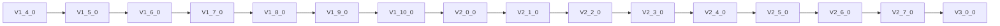

# Version Dependency Map

```mermaid
flowchart LR
  V1_4_0 --> V1_5_0
  V1_5_0 --> V1_6_0
  V1_6_0 --> V1_7_0
  V1_7_0 --> V1_8_0
  V1_8_0 --> V1_9_0
  V1_9_0 --> V1_10_0
  V1_10_0 --> V2_0_0
  V2_0_0 --> V2_1_0
  V2_1_0 --> V2_2_0
  V2_2_0 --> V2_3_0
  V2_3_0 --> V2_4_0
  V2_4_0 --> V2_5_0
  V2_5_0 --> V2_6_0
  V2_6_0 --> V2_7_0
  V2_7_0 --> V3_0_0
```

The order is binding by default. Reordering requires the governed roadmap-change process.
