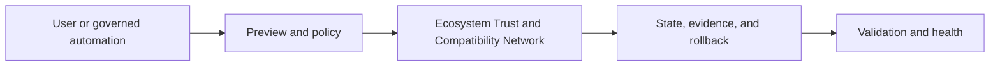

# v2.7.0 — Ecosystem Trust and Compatibility Network

> **Purpose:** Defines only the architecture delta from the canonical Forgevena platform blueprint.
> **Audience:** product, architecture, engineering, security, operations, documentation, release, and AI coding agents
> **Owner:** Trust and Compatibility Maintainers
> **Roadmap authority:** `docs/strategy/FORGEVENA_VERSIONED_PRODUCT_ROADMAP.md#v270--ecosystem-trust-and-compatibility-network`
> **Lifecycle:** planned
> **Review:** before implementation and at every lifecycle promotion

## Architecture Delta

Add Compatibility Laboratory, AI Evaluation Center, transparency records, advisories, dated certification evidence, appeals, and revocation propagation.

## Component and Module Boundaries

Committed features remain behind existing application-context, state, policy, consent, audit, and rollback services. No feature may introduce a parallel authority.

## Data and Control Flow

Inputs are schema-validated, classified, and policy-evaluated. External effects stop at consent boundaries. Outputs contain metadata and evidence references, while secrets and sensitive content remain excluded.

## Dependencies

- v2.6.0

## Failure Modes

- Partial operations recover from journals or last-known-good state.
- Unsupported compatibility fails visibly.
- Missing credentials, approval, billing, or network access stops at preflight.
- Corrupt or unverifiable evidence blocks promotion.
