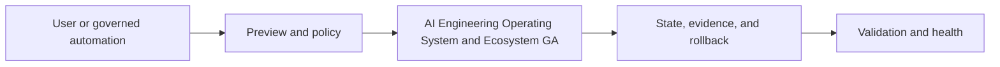

# v3.0.0 — AI Engineering Operating System and Ecosystem GA

> **Purpose:** Defines only the architecture delta from the canonical Forgevena platform blueprint.
> **Audience:** product, architecture, engineering, security, operations, documentation, release, and AI coding agents
> **Owner:** Forgevena Architecture and Ecosystem Maintainers
> **Roadmap authority:** `docs/strategy/FORGEVENA_VERSIONED_PRODUCT_ROADMAP.md#v300--ai-engineering-operating-system-and-ecosystem-ga`
> **Lifecycle:** planned
> **Review:** before implementation and at every lifecycle promotion

## Architecture Delta

Resolve mature local, registry, hub, control-plane, trust, workflow, intelligence, evidence, and operations contracts into one governed experience with explicit migration from 2.x.

## Component and Module Boundaries

Committed features remain behind existing application-context, state, policy, consent, audit, and rollback services. No feature may introduce a parallel authority.

## Data and Control Flow

Inputs are schema-validated, classified, and policy-evaluated. External effects stop at consent boundaries. Outputs contain metadata and evidence references, while secrets and sensitive content remain excluded.

## Dependencies

- v2.7.0

## Failure Modes

- Partial operations recover from journals or last-known-good state.
- Unsupported compatibility fails visibly.
- Missing credentials, approval, billing, or network access stops at preflight.
- Corrupt or unverifiable evidence blocks promotion.
